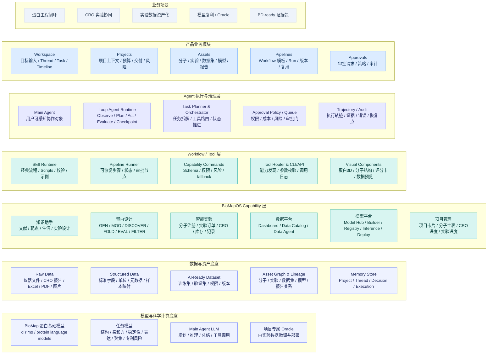

# BioMap Agent 计划书

版本：v0.1.2
日期：2026-05-27
面向对象：BioMapOS 研发体系负责人、公司管理层
资料来源：当前 BioMap Agent Demo 项目、BioMapOS Agentic AI 架构与界面方案、干湿闭环 Agent 商业价值调研报告、BioMapOS V1.0 各模块手册

---

## 1. 背景

BioMapOS V1.0 已经有一套较完整的生命科学研发软件底座：知识助手负责文献、靶点、生信分析和实验设计；蛋白设计平台负责序列挖掘、结构预测、生成设计、多目标优化、高通量评估和过滤；智能实验负责分子注册、实验订单、实验任务、CRO 订单、实验记录、库存和实验工作流；数据平台负责数据仪表盘、Data Catalog、AI-Ready 数据集和 Data Agent；模型平台负责 Model Hub、Model Builder、模型资产、在线推理和 Oracle 部署；项目管理负责项目卡片、分子主表、CRO 订单进度和实验进度。

这些模块解决了各自领域的问题，但当前产品形态仍然偏“六大模块并列”。用户要完成一个真实研发目标时，需要自己判断先去哪个模块、如何把上下文带到下一个模块、哪些结果应该资产化、哪些动作需要审批、失败后如何复盘。这里有三个直接问题：

1. **研发流程已经具备，但操作路径分散**：蛋白设计、实验验证、数据回收、模型微调和下一轮设计都能在现有系统里找到入口，实际推进时仍然依赖人工跨模块接力。
2. **AI 能力还停留在局部增强**：知识助手、Data Agent、模型平台和蛋白设计模型分别发挥作用，但还没有形成一个持续理解 Project / Thread 上下文、能规划、能调用工具、能暂停审批、能恢复执行的 Main Agent。
3. **证据链没有贯穿全流程**：生命科学研发不只看最终结果，还要回答“为什么这样做、用了哪些模型和数据、谁批准了什么、实验结果如何反哺模型”。这条轨迹需要从系统层记录。

行业也在从单点 AI 模型走向 Agentic R&D Workflow。客户很难长期为“一个会聊天的科研助手”付高价，但会为能执行、能审批、能追踪、能复用的研发流程付费。BioMap 的基础更适合做第二种：把已有模型、实验、数据、项目和交付能力组织成面向蛋白研发的 Agentic BioR&D OS。

因此，BioMap Agent 的定位应当是：

> **面向蛋白研发干湿闭环的 Agentic BioR&D OS。它以 Agent Workspace 为主入口，以 Project / Thread / Task / Asset / Pipeline / Approval 为核心对象，把知识调研、蛋白设计、结构预测、实验执行、CRO 管理、数据资产化、模型微调和项目交付串成一条可执行、可审批、可审计、可复用的研发流程。**

第一阶段不建议做“通用科研 Agent”，也不建议承诺“全自动科学家”。更可落地的方向是 Human-approved autonomous execution：Agent 负责准备计划、调用系统、生成草稿、追踪状态和汇总证据；高风险、高成本、高影响动作必须经过人类审批。

---

## 2. 商业价值

### 2.1 把多个系统打包成客户能理解的研发流程

当前 BioMapOS 的各模块可以分别销售和交付，但客户关心的是研发结果：能否更快从研发目标走到候选设计、实验验证数据、模型迭代和可交付报告。BioMap Agent 要把原本分散的模块接成一条清晰路径：

```text
研发目标 / FASTA / 候选分子
  -> 知识调研与项目上下文整理
  -> 蛋白设计、结构预测、性质评分和候选过滤
  -> 实验方案与 CRO / 内部实验订单草稿
  -> 审批与预算确认
  -> 实验执行、CRO 状态追踪和数据回收
  -> 数据清洗、标准化和 AI-Ready Dataset
  -> 模型微调、评估和 Oracle 部署
  -> 下一轮设计建议
  -> 项目周报、BD-ready 证据包和审计报告
```

这样更容易解释产品价值。客户看到的是一套围绕 design-build-test-learn 的交付流程，不会停留在几套模块的简单组合上。

### 2.2 提高高客单价模块的 attach rate

蛋白设计、智能实验、模型微调和私有化部署天然更接近高客单价；知识问答、数据分析和项目管理单独售卖时价值感较弱。Agent 化后，这些能力可以进入同一条高价值流程：

| 能力 | 单独销售时的问题 | 放进 Agent 流程后的价值 |
|---|---|---|
| 知识助手 | 容易被理解为问答工具 | 成为项目启动、靶点调研、实验方案和报告生成入口 |
| 数据平台 | 数据目录价值不容易直接转化成预算 | 成为实验数据回流、AI-Ready Dataset 和模型训练供给层 |
| 项目管理 | 容易被视为普通 PM 工具 | 成为 Project / Thread / Task / Approval / Delivery 的状态与证据聚合层 |
| 模型平台 | 单次训练难形成持续使用 | 成为每轮实验后微调 Oracle、反哺下一轮设计的节点 |
| 智能实验 | 实验系统复杂，销售解释成本高 | 成为 Agent 可发起、可审批、可追踪的湿实验执行层 |

### 2.3 形成可复制的 Workflow Pack

BioMap Agent 的商业化重点不宜放在“每个客户重新定制一套系统”上。更合理的方式是把高频流程做成可复制的 workflow pack。首批可以从这些流程开始：

| Workflow Pack | 目标客户 | 核心价值 |
|---|---|---|
| Protein Design-to-Validation Agent | Biotech、Pharma innovation team、BD 项目团队 | 从候选设计到实验验证和下一轮设计建议 |
| CRO Experiment Orchestration Agent | 虚拟 biotech、小型研发团队、跨境项目团队 | 统一实验方案、CRO RFQ、订单追踪、数据回收和审计 |
| BD-ready Scientific Evidence Agent | 中国创新药或蛋白资产出海团队 | 生成可追溯、可解释、可尽调的研发证据包 |
| Data Asset Workflow | 算法团队、数据团队、研发团队 | 将 BLI、SEC-HPLC、CRO 反馈等实验数据变成 AI-Ready Dataset |
| Model-to-Oracle Workflow | 算法团队、蛋白设计团队 | 将实验数据微调成可复用 Oracle 并部署回设计平台 |

这些 workflow pack 要作为产品资产管理，不能只停留在项目交付物。每个 workflow 都应包含输入对象、调用工具、审批节点、输出资产、异常处理、评测样例和报告模板。

### 2.4 建立研发证据链和审计轨迹

生命科学研发交付不能只给一份孤立报告，还要给出可追踪的证据链。BioMap Agent 需要把 Trajectory 做成产品能力：

- 谁提出了研发目标；
- Agent 读取了哪些 Project、Thread、文档、数据集和历史决策；
- 调用了哪些模型、工具、CLI、Skill 和 Workflow；
- 生成了哪些候选序列、结构模型、评分卡和实验方案；
- 为什么选择这些候选进入实验；
- 哪些动作触发了 Approval Request；
- 谁批准、驳回或修改了实验、预算、模型发布和客户报告；
- 实验在内部还是 CRO 执行；
- 原始数据如何进入 Data Platform；
- 数据如何清洗为 AI-Ready Dataset；
- 模型如何微调、评估和部署为 Oracle；
- 下一轮设计如何利用新数据；
- 最终报告中的结论对应哪些实验、数据和模型版本。

这条轨迹可以同时服务内部研发复盘、客户交付、BD 尽调、质量审计和 IPO 材料。

### 2.5 形成数据飞轮

BioMap Agent 的长期壁垒不应只押在模型或对话体验上。每次流程运行后留下的结构化资产更关键：

```text
Target / Hypothesis
  -> DesignBatch / ProteinSequence / StructureModel
  -> ExperimentOrder / Protocol / Sample / CROOrder
  -> RawData / AssayResult / AnalysisRun
  -> Dataset / ModelRun / Oracle
  -> Decision / Approval / Report
  -> Next Design
```

这些对象及其关系会形成专有数据飞轮。失败实验、CRO 反馈、审批驳回、字段映射错误和模型评估失败也应进入受控的 Rollout Data，用于补充 Skill Eval Group、改进脚本校验、优化 CLI 合约，并提高 Agent 执行稳定性。

### 2.6 改变研发和交付成本曲线

对研发体系和老板来说，Agent 化会同时影响产品功能和组织效率。传统模式下，每增加一个客户流程，往往要新增前端页面、后端接口、表单状态、权限逻辑、报表、测试和实施。Agent + Workflow 模式可以把新增需求更多转成：

- Tool / CLI 接口；
- Capability Command；
- Skill；
- Workflow JSON；
- Approval Policy；
- Data Schema；
- Report Template；
- Eval Case。

这会改变核心产研团队的工作重心：少做一次性的业务页面，多做统一 Agent 底座、对象模型、工具协议、审批审计、Workflow Runtime 和评测体系。交付团队也可以采用 FDE 模式，把客户需求转成 workflow 配置，接入客户现有 LIMS、ELN、Data Lake、CRO 流程和审批链，再把项目经验回收为标准 workflow pack。

建议长期跟踪的经营指标包括：

| 指标类别 | 示例指标 |
|---|---|
| 周期 | 从目标提出到实验订单草稿的时间、从实验结果到 AI-Ready Dataset 的时间、从模型评估到 Oracle 发布的时间 |
| 吞吐 | 每个 scientist / PM / data scientist 每周推进的 Task 数、每个 Project 的 design-build-test-learn 循环数 |
| 成本 | 人工跨模块操作次数、手工录入字段数、PM 协调时间、重复数据清洗时间 |
| 质量 | Capability Command 成功率、Skill Eval Run 通过率、数据字段准确率、单位换算错误率、报告引用覆盖率 |
| 治理 | 审批响应时间、Trajectory 覆盖率、审计证据完整率、人工接手恢复成功率 |
| 经营杠杆 | Workflow 复用率、新 workflow 上线时间、单 FDE 支持项目数、交付毛利、Revenue per FTE |

### 2.7 商业价值指标口径

第一阶段不建议直接对外承诺“效率提升 500%+”“自动化准确率 99.9%+”这类结果数字。更稳妥的写法是把它们定义为内部目标指标或验证指标：先用当前流程建立基线，再用 2-3 条 pilot workflow 验证提升幅度。

| 价值方向 | 第一阶段验证口径 | 建议采集对象 |
|---|---|---|
| 科研操作效率 | 从研发目标输入到实验订单草稿生成的时间；人工跨模块点击 / 填表次数；一个 scientist 每周可推进的 Agent Task 数 | Thread、Task、Pipeline Run、ExperimentOrder |
| 交付效率 | 一个 FDE 可同时支持的项目数；从客户需求到 workflow pack 初版的时间；定制开发需求中可由配置解决的比例 | Project、Workflow Pack、Capability Command、Delivery Report |
| 数据飞轮 | Trajectory 覆盖率；AI-Ready Dataset 生成数；Rollout Data 转成评测用例的数量；workflow 复用率 | Trajectory、Dataset、Eval Case、Workflow Version |
| 产研效率 | 新 Capability Command 接入时间；新增 Visual Component 时间；同类 CRUD / 表单变更由 Agent builder 完成的比例 | Capability Command、Visual Component、Frontend Module、API / CLI |
| 执行准确率 | Workflow 成功率；审批驳回率；人工接手率；关键字段抽取准确率；单位换算错误率 | Pipeline Run、Approval Request、Handoff Event、Data Mapping |

这些指标可以分成两类汇报：对研发管理层，重点看 workflow 稳定性、工具延迟、失败恢复和产研效率；对老板和客户，重点看研发周期、交付效率、数据飞轮和可审计证据链。

---

## 3. Demo

Demo 建议分两条线：当前已有 Demo 展示 BioMap Agent 的主入口；下一阶段 Demo 展示 Agent 如何推进一条真实的干湿闭环流程。

### 3.1 当前项目 Demo

当前 `/Users/songxuzhengjun/Documents/BioMapAgent` 是一个 Vite + React 前端 Demo，主要表达 Agent Workspace 首页。

当前 Demo 可截图内容：

1. **Agent Workspace 首页全景**
   - 截图位置：浏览器打开当前 Demo 首页。
   - 画面重点：顶部导航包含 Agent、Projects、Assets、Pipelines；左侧是 Project / Thread；中间是“我能为你的研发做什么？”输入框；下方是能力 chips 和 Use Case Cards。
   - 截图用途：说明 BioMap Agent 的默认入口是以 Project 和 Thread 为上下文的研发工作台，不再让用户先从六大模块里选入口。

2. **Project / Thread 左侧栏**
   - 截图位置：左侧项目列表区域。
   - 画面重点：Antibody Optimization、Enzyme Discovery、Data Assetization、Model-to-Oracle、Protein Delivery 等 Project；每个 Project 下有多个 Thread。
   - 截图用途：说明 Project 是长期业务容器，Thread 是持续协作上下文，不能按一次性聊天记录处理。

3. **中心 Composer**
   - 截图位置：主区域输入框及项目选择行。
   - 画面重点：用户可以描述研发目标，选择目标 Project，点击能力 chips 或案例卡预填研发目标。
   - 截图用途：说明用户先描述研发目标，再由 Agent 选择需要调用的能力。

4. **Use Case Cards**
   - 截图位置：案例卡区域。
   - 当前卡片包括：调研靶点机制与竞品、从候选分子生成湿实验订单、整理实验结果为 AI-Ready Dataset、用实验数据微调 Oracle、生成项目周报与风险列表、项目交付追踪。
   - 截图用途：首页卡片用于启动高频 workflow，避免做成营销展示。

### 3.2 下一阶段 Demo 贴图建议

为了让研发负责人和老板看到完整路径，下一阶段建议补 6 张关键 Demo 图。

#### Demo 图 1：Thread 工作区

画面应包含：

- 左侧 Project / Thread 列表；
- 中间 Main Agent 对话、计划和结果；
- 右侧 Context Pack、关联资产、活跃 Task 和待审批摘要；
- Thread 内显示 Goal、选入的数据集、候选分子、实验记录和历史决策。

截图用途：

> Thread 是研发目标的长期工作空间。用户可以在同一个 Thread 中推进知识调研、设计、实验、数据、模型和交付。

#### Demo 图 2：Design-to-Wet-Lab Task Execution Timeline

画面应包含：

- Task 目标：从候选分子生成湿实验验证方案和订单草稿；
- Timeline：读取候选分子、校验结构和评分、生成实验方案、估算成本、创建 Approval Request；
- 中间工作区展示实验方案表、候选分子表、风险提示；
- 底部 Review Bar：批准、驳回、修改、打开原实验表单。

截图用途：

> Agent 不只回答问题，还要拆解任务、调用工具、生成产物、暂停等待审批，并保留执行轨迹。

#### Demo 图 3：Asset Detail

画面应包含：

- Molecule / Dataset / Model / Report 任一资产详情页；
- Overview、Lineage、Evidence、Actions、Permissions、Timeline；
- 资产从哪个 Task 生成、被哪些实验验证、进入了哪个数据集、是否训练过模型。

截图用途：

> BioMap Agent 的输出应进入 R&D Asset，不能只留在聊天文本里。

#### Demo 图 4：Pipeline Run

画面应包含：

- Pipeline 模板：experiment_result_to_ai_ready_dataset 或 model_release_to_oracle；
- 步骤列表：输入校验、工具调用、脚本运行、审批节点、输出资产；
- 每一步状态：pending / running / waiting approval / completed / failed；
- 失败节点可重试或人工接手。

截图用途：

> 高频跨模块流程要固化为 Pipeline / Workflow，减少每次自由规划带来的不稳定。

#### Demo 图 5：Approval Queue

画面应包含：

- 待审批列表：湿实验订单、CRO 下单、训练成本、模型发布、对外报告；
- 审批卡片展示 Agent 想做什么、为什么做、使用哪些资产、预计成本、风险和替代方案；
- 操作：批准、驳回、修改、分派。

截图用途：

> 审批和治理是 BioMap Agent 进入生命科学高风险流程的安全阀。

#### Demo 图 6：闭环总览 Dashboard

画面应包含：

- 一个 Project 的闭环进度：Research -> Design -> Experiment -> Data -> Model -> Report；
- 当前活跃 Task、已完成资产、等待审批、风险和下一步建议；
- 周期、吞吐、数据资产化率、审批 SLA 等指标。

截图用途：

> 研发负责人可以在一个视图里看项目流程、资产、风险和审批，不用去多个模块里拼状态。

### 3.3 推荐演示脚本

建议用“抗体优化闭环”做主线：

1. 用户在 Antibody Optimization Project 中输入：`基于当前候选分子，帮我生成湿实验验证方案和订单草稿。`
2. Main Agent 读取候选分子、结构预测、评分卡和项目约束。
3. Agent 展示计划：候选校验、实验设计、预算估算、审批、实验执行、数据回收。
4. Agent 生成实验方案草稿和 CRO / 内部实验订单草稿。
5. 触发 Approval Request，展示审批卡片。
6. 审批通过后，Pipeline 进入实验执行状态。
7. 实验结果回流后，Agent 生成 AI-Ready Dataset。
8. Agent 建议微调 Oracle，并生成模型评估任务。
9. Oracle 发布后，Agent 生成下一轮设计建议和项目周报。

---

## 4. 产品业务架构

### 4.1 架构原则

BioMap Agent 的业务架构建议按以下原则设计：

1. **Agent-first，旧系统继续保留**
   默认入口是 Agent Workspace；旧模块保留为专业页面、详情页、配置页和人工接手入口。

2. **前台只暴露 Main Agent，后台按能力拆分**
   用户只感知 Main Agent；后台可以有 Knowledge Worker、Design Worker、Experiment Worker、Data Worker、Model Worker、Delivery Worker，但不作为前台多个 Agent 暴露。

3. **Project / Thread / Task 作为工作模型**
   Project 管业务归属、权限、预算和交付；Thread 管连续协作上下文；Task 管一次可追踪、可暂停、可恢复的 Agent 执行。

4. **Asset 覆盖研发产物和证据**
   分子、结构、实验订单、CRO 订单、Raw Data、AI-Ready Dataset、模型版本、Oracle、报告和决策都应成为可追溯资产。

5. **Pipeline / Workflow 承载可复用流程**
   高频干湿闭环不应依赖自由对话，需要固化为 Skill、Scripts、Capability Command 和 Workflow。

6. **Approval 作为一等对象**
   湿实验、CRO 下单、预算消耗、模型发布、Oracle 部署和对外交付必须有 Approval Policy、Approval Request 和审计记录。

7. **Trajectory 作为底层事实记录**
   用户看到简化的 Execution Timeline；系统保留完整 Trajectory，用于审计、复盘、评测和持续改进。

### 4.2 业务架构图

这张图只表达分层关系，不画每个系统之间的调用线。具体分层说明、对象关系、旧系统映射和闭环数据流放在后面的 4.3-4.7 节展开。



### 4.3 架构分层说明

| 层级 | 回答的问题 | 第一阶段重点 | 边界 |
|---|---|---|---|
| 业务场景层 | BioMap Agent 先服务哪些研发工作 | 蛋白工程闭环、CRO 实验协同、实验数据资产化、模型复利 / Oracle、BD-ready 证据包 | 不把所有科研任务都纳入第一阶段 |
| 产品业务模块层 | 用户在前台看到什么、在哪里推进工作 | Workspace、Projects、Assets、Pipelines、Approvals | Capabilities 不建议作为普通用户一级模块 |
| Agent 执行与治理层 | Main Agent 如何推进任务 | Main Agent、Loop Agent Runtime、Task Planner、Memory、Approval、Trajectory | 后台 worker 可以存在，但不作为多个前台 Agent 暴露 |
| Workflow / Tool 层 | 旧系统能力如何被 Agent 稳定调用 | Skill Runtime、Pipeline Runner、Capability Command、Tool Router、CLI/API、Visual Components | 不让 Agent 直接猜旧页面怎么操作 |
| BioMapOS Capability 层 | 旧系统如何保留和复用 | 知识助手、蛋白设计、智能实验、数据平台、模型平台、项目管理 CLI/API 化 | 旧页面保留为专业查看、配置、人工接手和审计入口 |
| 数据与资产底座 | Agent 执行后留下什么 | Raw Data、Structured Data、AI-Ready Dataset、Asset Graph、Trajectory、Memory | 不只保存聊天记录 |
| 模型与科学计算底座 | 模型如何支撑研发闭环 | BioMap 蛋白基础模型、任务模型、Main Agent LLM、项目专属 Oracle | 模型价值要通过实验数据和 workflow 反馈持续放大 |

#### 4.3.1 业务场景层

| 场景 | 典型输入 | 典型输出 | 首阶段建议 |
|---|---|---|---|
| 蛋白工程闭环 | 靶点、候选序列、结构、项目约束 | 候选短名单、实验方案、下一轮设计建议 | 作为首个主线场景 |
| CRO 实验协同 | 实验目标、候选分子、预算、CRO 偏好 | CRO RFQ、订单、SLA、回收数据 | 与智能实验和审批一起演示 |
| 实验数据资产化 | BLI、SEC-HPLC、表达、纯化、CRO 文件 | Structured Data、AI-Ready Dataset、数据质量报告 | 作为第二条 workflow |
| 模型复利 / Oracle | AI-Ready Dataset、基础模型、评估指标 | 模型版本、体检报告、Oracle 部署草稿 | 作为第三条 workflow |
| BD-ready 证据包 | Project、Thread、Task、Asset、Decision | 科学 rationale、图表、审计链、交付包 | 可先做报告草稿，不急于全自动 |

#### 4.3.2 产品业务模块层

| 模块 | 用户看到什么 | 负责什么 | 不负责什么 |
|---|---|---|---|
| Workspace | Agent 工作区、Thread、Task、Timeline | 目标输入、上下文组织、执行过程、审批提示、产物预览 | 不替代所有专业详情页 |
| Projects | 项目列表、项目详情、项目进度 | 项目上下文、权限、预算、交付、风险聚合 | 不重做旧项目管理的所有表单 |
| Assets | 资产目录、资产详情、资产血缘 | 分子、实验、数据集、模型、报告、决策记录 | 不把普通聊天消息都资产化 |
| Pipelines | Workflow 模板、Run 状态、版本 | 高频流程运行、审批暂停、失败恢复、复用管理 | 不让用户手工拼底层 tool call |
| Approvals | 审批队列、审批详情、审批策略 | 湿实验、CRO、预算、模型发布、对外交付等授权 | 不由 LLM 临场决定审批链路 |

Capabilities 更适合放在后台能力中心，管理 Workflow、Skill、MCP、Plugin、CLI/API 和 Capability Command。普通用户应通过 Workspace、Pipelines 和 Assets 调用能力，而不是直接选择底层能力。

#### 4.3.3 Agent 执行与治理层

| 单元 | 职责 | 关键能力 | 研发关注点 |
|---|---|---|---|
| Main Agent | 用户可感知的协作对象 | 对话、解释、计划展示、审批请求、结果总结 | 避免暴露多个专业 Agent 给用户 |
| Loop Agent Runtime | Agent 执行循环 | observe / plan / act / evaluate / checkpoint，暂停、恢复、重试 | 性能、长任务恢复、流式反馈 |
| Task Planner | 任务拆解和路由 | 选择 Pipeline、Skill、Capability Command、旧系统入口 | 计划可解释、步骤可追踪 |
| Memory Control | 上下文和记忆管理 | Project、Thread、Asset、Decision、Execution Memory | 避免每次从零开始，控制权限边界 |
| Approval Policy / Queue | 审批治理 | 动作分级、审批路由、审批卡片、审批恢复 | 审批策略配置化，不由 LLM 临场决定 |
| Trajectory / Audit | 执行事实记录 | 工具、脚本、审批、产物、错误、恢复点 | 审计、复盘、评测和 rollout data |

#### 4.3.4 Workflow / Tool 层

| 单元 | 职责 | 输入输出要求 | 和旧系统关系 |
|---|---|---|---|
| Skill Runtime | 执行经典流程 | 包含脚本、校验、示例、失败处理 | 编排旧系统 CLI/API 和 Capability Command |
| Pipeline Runner | 管理 workflow 运行 | 步骤、状态、审批节点、恢复点、输出资产 | 支撑 workflow pack 产品化 |
| Capability Command | 旧能力的标准命令接口 | Schema、权限、风险、成本、fallback、审计 | 旧模块能力 CLI/API 化后的统一入口 |
| Tool Router & CLI/API | 工具发现和调用 | 参数校验、调用日志、错误码、版本 | 避免 Agent 直接操作旧页面 |
| Visual Components | 前端结果展示 | 蛋白 3D、模型图表、富表格、实验方案表、数据质量报告 | 复杂结果组件化，而不是全转文本 |

#### 4.3.5 BioMapOS 能力层

| 现有模块 | 保留价值 | Agent 化方式 | 典型输出 |
|---|---|---|---|
| 知识助手 | 文献、靶点、生信、实验设计能力 | 合并进 Main Agent 的知识和报告能力 | 文献证据、靶点报告、实验设计草稿 |
| 蛋白设计 | GEN、MOO、DISCOVER、FOLD、EVAL、FILTER | 核心能力 CLI/API 化，结果用 Visual Components 展示 | 候选分子、结构、评分卡、过滤结果 |
| 智能实验 | 分子注册、实验订单、CRO、库存、记录 | 实验相关动作命令化，原表单作为 fallback | ExperimentOrder、CROOrder、ExperimentRecord |
| 数据平台 | Catalog、Data Agent、AI-Ready Dataset | 数据检索、清洗、注册命令化 | Dataset、Data Quality Report、Lineage |
| 模型平台 | Model Hub、Builder、Registry、Inference、Deploy | 训练、评估、发布、Oracle 部署命令化 | Model、ModelRun、Oracle |
| 项目管理 | 项目卡片、分子主表、CRO / 实验进度 | 接入 Project Context 和 Delivery 视图 | 项目状态、风险、周报、交付包 |

#### 4.3.6 数据资产和模型底座

| 底座对象 | 内容 | 用途 |
|---|---|---|
| Raw Data | 仪器文件、CRO 报告、Excel、PDF、图片 | 保存原始证据 |
| Structured Data | 标准字段、单位、元数据、样本映射 | 支撑检索、分析和质量检查 |
| AI-Ready Dataset | 训练集、验证集、权限、版本 | 供模型训练和评估使用 |
| Asset Graph & Lineage | 分子、实验、数据集、模型、报告关系 | 支撑追溯、复用和审计 |
| Trajectory | 工具调用、脚本、审批、产物、错误、恢复点 | 支撑审计、复盘、评测和优化 |
| Memory Store | Project、Thread、Decision、Execution Memory | 支撑长上下文恢复和连续协作 |
| BioMap 蛋白基础模型 | xTrimo / protein language models | 支撑设计、预测和评分 |
| 任务模型 | 结构、亲和力、稳定性、表达、聚集、专利风险 | 支撑专业判断和筛选 |
| Main Agent LLM | 规划、推理、总结、工具调用 | 支撑 Agentic loop |
| 项目专属 Oracle | 由项目实验数据微调并部署 | 支撑下一轮设计和模型复利 |

### 4.4 核心对象模型

| 对象 | 一句话定义 | 包含什么 | 不等于什么 | 关键关系 |
|---|---|---|---|---|
| Project | 长期业务容器，通常对应客户项目、内部研发项目或交付项目 | 项目目标、权限、预算、成员、里程碑、Thread、Asset、Approval、交付物 | 不是单次对话，也不是 BioMap Agent 产品本身 | 一个 Project 可包含多个 Thread、Task、Pipeline Run、Asset 和 Approval Request |
| Thread | Project 内的连续协作上下文 | 对话、Context Pack、历史假设、Task、Decision、Output | 不是一次任务，也不是普通聊天记录 | 一个 Thread 可发起多个 Task，并关联多个 Asset 和 Decision |
| Task | Main Agent 在 Thread 中发起的一次执行记录 | 目标、计划、状态、工具调用、审批节点、产物、错误 | 不是项目管理里的人工任务，也不是智能实验里的 Experiment Task | Task 可启动一个或多个 Pipeline Run，并写入 Trajectory |
| Pipeline Run | 某个 Workflow 的一次运行实例 | 步骤、输入资产、输出资产、状态、日志、审批节点、恢复点 | 不是静态模板，也不是单个 tool call | 通常由 Task 触发，运行过程中调用 Skill 和 Capability Command |
| Pipeline / Workflow | 可复用、可恢复的业务流程模板 | 步骤定义、输入输出、审批节点、失败处理、版本 | 不是单次运行记录 | 产生多个 Pipeline Run，可产品化为 workflow pack |
| Skill | 经典流程的执行包 | 脚本、CLI 编排、参数校验、示例、评测用例 | 不是普通提示词 | 被 Pipeline 或 Task 调用，提升流程稳定性 |
| Capability Command | 旧系统能力的标准命令接口 | Schema、权限、风险等级、成本估算、Approval Policy、fallback、审计事件 | 不是页面按钮，也不是自由文本指令 | 连接 Agent / Pipeline 与旧系统 CLI/API |
| Asset | 可复用的研发产物或证据对象 | Molecule、ExperimentOrder、CROOrder、ExperimentRecord、Dataset、Model、Oracle、Report、Decision | 不是普通附件，也不是所有聊天内容 | 被 Project、Thread、Task、Pipeline Run 引用和生成 |
| Approval Request | 对高风险动作的审批请求 | 审批动作、审批人、输入资产、输出资产、风险、成本、理由、决策 | 不是通知消息本身 | 由 Task 或 Pipeline Run 触发，审批结果写入 Trajectory 和 Audit |
| Trajectory Event | Agent 执行事实记录 | 上下文、计划、工具、脚本、命令、审批、错误、产物 | 不是用户可见的完整聊天记录 | 支撑审计、复盘、评测和 rollout data |
| Rollout Data | 从 Trajectory 中受控抽取的改进数据 | 失败样本、不稳定步骤、人工接手、审批驳回、评测候选 | 不是原始客户数据直接外流 | 用于补充 Eval Case、改进 Skill 和工具契约 |

对象关系可以简化为：

```text
Project
  -> Thread
    -> Task
      -> Pipeline Run
        -> Skill / Capability Command / Tool Call
      -> Approval Request
      -> Asset
      -> Trajectory Event
```

### 4.5 旧系统到 Agent 能力的映射

| 旧模块 | 在 BioMap Agent 中的新定位 | 典型 Capability Command |
|---|---|---|
| 知识助手 | 合并进 Main Agent 的知识调研、报告生成、实验方案和生信分析能力 | `knowledge.search`、`literature.review`、`target.evaluate`、`bioinfo.run`、`report.draft` |
| 蛋白设计 | 保留专业页面；核心能力 CLI 化并作为 Design Capability | `protein.generate`、`protein.optimize`、`protein.fold`、`protein.evaluate`、`protein.filter` |
| 智能实验 | 保留实验详情和原表单；订单、CRO、库存、实验记录能力命令化 | `molecule.register`、`experiment.order.draft`、`experiment.order.submit`、`cro.rfq`、`cro.order.track`、`inventory.reserve` |
| 数据平台 | 从数据目录升级为 Agent 可读写的资产中枢 | `data.search`、`data.ingest`、`data.normalize`、`dataset.register`、`dataset.permission.request` |
| 模型平台 | 模型训练、评估、发布和 Oracle 部署能力命令化 | `model.train`、`model.evaluate`、`model.publish`、`oracle.deploy`、`inference.run` |
| 项目管理 | 从项目卡片升级为 Project / Thread / Task / Delivery 聚合视图 | `project.create`、`project.status`、`milestone.update`、`risk.generate`、`delivery.package` |

### 4.6 典型闭环数据流


### 4.7 审批等级建议

| 等级 | 动作类型 | 审批要求 |
|---|---|---|
| L0 | 查询、总结、读取公开或已授权数据 | 不需要审批 |
| L1 | 生成候选、生成实验建议、模拟分析、报告草稿 | 可选审批或事后记录 |
| L2 | 写入项目数据、注册数据集、创建实验订单草稿、生成 CRO RFQ | 需要审批 |
| L3 | 提交湿实验、CRO 下单、消耗预算、占用库存、处理样本 | 强审批 |
| L4 | 模型发布、Oracle 部署、对外报告、BD 材料定稿、审批策略变更 | 强审批 + 复核 |

---

## 5. 模块

### 5.1 Workspace

#### 定位

Workspace 是 BioMap Agent 的默认主入口，负责承接研发目标、Project 上下文、Thread 连续协作、Task 执行和 Agent 产物展示。它按研发执行工作台设计，不能只做普通 Chatbot 页面。

| 维度 | 说明 |
|---|---|
| 定位 | Main Agent 工作区，承接目标输入、Thread 协作、Task 执行和结果展示 |
| 核心用户 | 科研人员、项目负责人、交付人员、算法 / 数据人员 |
| 核心对象 | Project、Thread、Task、Context Pack、Execution Timeline、Visual Component |
| 关键页面 | Agent Home、Thread Workspace、Task Detail |
| MVP 重点 | 让一个 Use Case 跑通目标输入、Task Plan、Approval Request 和资产输出 |
| 不做范围 | 不替代所有专业页面，不在第一阶段做完整实验 / 模型 / 数据管理后台 |

#### 核心对象

- Project：当前研发项目或客户项目。
- Thread：一个持续协作上下文，例如“EGFR 抗体亲和力优化”。
- Task：一次可追踪的 Agent 执行，例如“生成湿实验订单草稿”。
- Context Pack：用户或 Agent 选入的文档、分子、实验记录、数据集、模型和约束。
- Execution Timeline：用户可理解的执行轨迹摘要。
- Visual Component：蛋白 3D、结构比对、评分卡、数据预览、实验方案表。

#### 关键页面

1. **Agent Home**
   - 当前 Demo 已覆盖第一版：首页输入框、Project / Thread 侧栏、Use Case Cards、能力 chips。
   - 后续需要补充活跃 Task、最近产物、待审批和风险摘要。

2. **Thread Workspace**
   - 中间为对话、计划、执行状态和结果；
   - 左侧为 Project / Thread / 活跃 Task；
   - 右侧为 Context Pack、关联资产、待审批、下一步动作和人工接手入口。

3. **Task Detail**
   - 展示目标、计划、阶段、工具调用、输入输出、审批状态、失败处理和产物。
   - 适合研发负责人检查 Agent 到底做了什么。

#### 关键能力

- 从自然语言研发目标创建或继续 Thread。
- 自动读取 Project、资产、历史 Thread、实验记录、数据集和模型上下文。
- 将目标拆成 Task Plan。
- 调用 Skill、Pipeline 和 Capability Command。
- 展示命令预览、风险、成本和审批点。
- 在 Approval Gate 暂停，并在审批后恢复。
- 将输出写入资产记录，避免只留在对话中。
- 失败后说明失败节点、已完成产物、可重试方案和人工接手入口。

#### 与当前 Demo 的关系

当前 Demo 是 Workspace 的首页雏形，已经建立了主入口结构：

- 顶部导航：Agent / Projects / Assets / Pipelines；
- 左侧：Project / Thread；
- 中间：目标输入框；
- 下方：Use Case Cards；
- 轻交互：选择 Thread、切换 Project、点击卡片预填目标。

下一步应从“首页 Demo”升级为“可执行 Thread Demo”。优先让一个 Use Case 跑通 Task Plan、Execution Timeline、Approval Request 和资产输出，静态卡片可以先少加。

#### MVP 范围

- Thread 创建、选择、重命名、置顶、归档和删除。
- Task Plan 展示。
- 2-3 个 Use Case 能创建模拟 Task。
- Task Execution Timeline 前端展示。
- Context Pack 的手动选择和展示。
- 关联资产预览。
- Approval Gate 的前端模拟。
- 原表单 / 旧模块 fallback 链接。

#### 后续演进

- 接入真实 Main Agent Runtime。
- 接入真实 Capability Command。
- 接入真实 Trajectory Store。
- 支持长任务恢复和审批后继续执行。
- 支持 Visual Component 内联渲染蛋白结构、评分卡和数据图表。

### 5.2 Projects

#### 定位

Projects 是业务归属和交付管理层。它负责组织 BioMap Agent 中的 Thread、Task、Asset、Pipeline Run、Approval 和 Delivery，项目列表只是其中一个视图。

| 维度 | 说明 |
|---|---|
| 定位 | Project 级上下文、状态和交付聚合层 |
| 核心用户 | 项目负责人、PM、交付团队、研发管理者 |
| 核心对象 | Project Record、Project Memory、Project Timeline、Project Delivery |
| 关键页面 | Project List、Project Overview、Project Threads、Project Evidence |
| MVP 重点 | 聚合项目下 Thread、活跃 Task、待审批、关键资产和风险 |
| 不做范围 | 不重做旧项目管理全部表单，不替代专业实验 / CRO 详情页 |

#### 核心对象

- Project Record：项目编号、名称、负责人、PM、标签、优先级、状态。
- Project Memory：项目目标、客户背景、实验约束、预算、历史决策。
- Project Timeline：关键里程碑、活跃 Task、实验进度、CRO 进度、模型和数据状态。
- Project Delivery：周报、风险、交付包、BD-ready 证据包。

#### 关键页面

1. **Project List**
   - 项目卡片或表格；
   - 支持按负责人、PM、标签、名称、状态筛选；
   - 展示未处理审批、CRO 阻塞、活跃 Task 和风险数量。

2. **Project Overview**
   - 展示项目目标、当前阶段、里程碑、风险、待审批、关键资产和下一步建议。

3. **Project Threads**
   - 展示该 Project 下所有 Thread；
   - 按最近活动、风险、活跃 Task、置顶状态排序。

4. **Project Evidence**
   - 聚合分子主表、实验进度、CRO 订单、数据集、模型、报告和审计轨迹。

#### 关键能力

- 作为新 Thread 和 Task 的默认上下文。
- 控制项目级权限、预算和审批策略。
- 聚合项目内资产和执行状态。
- 生成项目周报、风险列表、客户汇报和 BD 证据包。
- 从项目层追溯每个结论对应的实验、数据和模型版本。

#### 与现有项目管理模块的关系

现有项目管理模块已经有项目卡片、项目编号、项目负责人、项目经理、标签、分子主表、CRO 订单进度和实验进度。BioMap Agent 不需要重做这些基础能力，应该把它们接入 Agent 可读写的 Project Context：

- 分子主表进入 Assets；
- CRO 订单和实验进度进入 Project Timeline；
- 项目标签和负责人进入权限、审批和路由；
- 项目状态成为 Agent 生成周报和风险列表的输入。

#### MVP 范围

- Project 列表和详情。
- Project 下 Thread 聚合。
- 项目级活跃 Task 和待审批聚合。
- 项目级资产索引。
- 项目周报和风险列表草稿生成。

#### 后续演进

- 项目级预算、成本和资源管理。
- 项目级 Approval Policy 继承和覆盖。
- 客户交付包和 Data Room 索引。
- 多项目 Portfolio View。

### 5.3 Assets

#### 定位

Assets 是 BioMap Agent 的研发资产库。Agent 产生的关键结果要进入资产记录，不能停留在对话文本里。Assets 统一管理分子、结构、实验、数据集、模型、Oracle、报告和决策记录。

| 维度 | 说明 |
|---|---|
| 定位 | 研发资产和证据对象管理层 |
| 核心用户 | 科研人员、数据 / 算法人员、项目负责人、审计 / 交付角色 |
| 核心对象 | Molecule、ExperimentOrder、CROOrder、ExperimentRecord、Dataset、Model、Oracle、Report、Decision |
| 关键页面 | Asset Catalog、Asset Detail、Asset Graph、Dataset Detail、Model / Oracle Detail |
| MVP 重点 | 先支持 Molecule、ExperimentOrder、Dataset、Model、Report 五类资产 |
| 不做范围 | 不把所有聊天消息资产化，不在第一阶段做完整 Data Room |

#### 核心资产类型

| 资产类型 | 示例 | 关键字段 |
|---|---|---|
| Molecule / ProteinSequence | 抗体、VHH、酶、多肽、突变体 | 序列、构型、来源、突变位点、项目、评分 |
| StructureModel | PDB / CIF 结构预测 | 模型版本、置信度、结构文件、可视组件 |
| DesignBatch | 一批候选设计 | 生成参数、过滤规则、排序、候选短名单 |
| ExperimentOrder | 实验订单 | 分子、实验目标、制备步骤、测定性质、审批状态 |
| CROOrder | CRO 订单 | CRO 公司、报价、SLA、状态、交付文件 |
| ExperimentRecord | 实验记录 | 参数、过程、结果、仪器、样本、文件 |
| RawData | 原始数据 | 文件、来源、hash、权限、绑定实验 |
| Dataset | AI-Ready Dataset | Schema、字段、标签、版本、权限、训练用途 |
| Model | 模型资产 | 版本、指标、训练数据、发布状态、权限 |
| Oracle | 部署到蛋白设计平台的打分器 | 属性名、目标、有效范围、部署版本 |
| Report | 项目报告、BD 材料、审计报告 | 结论、引用资产、审批状态、发布版本 |
| Decision | 研发决策记录 | 决策人、理由、证据、影响资产 |

#### 关键页面

1. **Asset Catalog**
   - 支持按 Project、类型、来源、状态、权限、更新时间筛选。

2. **Asset Detail**
   - 统一信息结构：Overview、Lineage、Evidence、Actions、Permissions、Timeline。

3. **Asset Graph**
   - 展示分子、实验、数据集、模型、报告之间的血缘关系。

4. **Dataset Detail**
   - 展示 Raw / Structured / AI-Ready 状态、字段映射、质量报告、权限和训练使用记录。

5. **Model / Oracle Detail**
   - 展示模型版本、评估指标、训练数据、部署状态、调用记录和下游设计任务。

#### 关键能力

- 将 Agent 输出写入资产记录。
- 跨模块资产统一检索。
- 资产 lineage 追踪。
- 资产权限和数据等级控制。
- 资产可被 Pipeline 作为输入。
- 资产变更进入审计记录。
- 从资产反查相关 Thread、Task、Approval 和报告。

#### 与现有模块的关系

- 蛋白设计平台产生 Molecule、StructureModel、DesignBatch 和评分卡。
- 智能实验产生 ExperimentOrder、CROOrder、ExperimentRecord 和 RawData。
- 数据平台产生 Dataset、Data Quality Report 和 Data Catalog 条目。
- 模型平台产生 Model、ModelRun、Evaluation Report 和 Oracle。
- 项目管理产生 Project Summary、Delivery Report 和风险记录。
- 知识助手产生 Research Report、Literature Evidence 和实验设计草稿。

#### MVP 范围

- 先支持 Molecule、ExperimentOrder、Dataset、Model、Report 五类资产。
- 每类资产有统一详情结构。
- 支持资产与 Project、Thread、Task 的关系。
- 支持资产 lineage 基础展示。
- 支持从 Task 输出资产。

#### 后续演进

- 完整 Asset Graph。
- 多版本比较。
- 权限继承和数据等级策略。
- 资产订阅和变更通知。
- 对外 Data Room / BD-ready 证据包。

### 5.4 Pipelines

#### 定位

Pipelines 是 BioMap Agent 的可复用流程层。它把高频跨模块研发流程从“靠人记步骤”改成可配置、可执行、可恢复、可评测、可审计的 Workflow。

| 维度 | 说明 |
|---|---|
| 定位 | 可复用 workflow 管理和运行层 |
| 核心用户 | 交付团队、平台工程、研发负责人、高级业务用户 |
| 核心对象 | Pipeline Template、Pipeline Run、Skill、Capability Command、Eval Case |
| 关键页面 | Pipeline Template List、Pipeline Builder / Config、Pipeline Run Detail、Pipeline Eval |
| MVP 重点 | 先做 `design_to_wet_lab_order`、`experiment_result_to_ai_ready_dataset`、`model_release_to_oracle` |
| 不做范围 | 不让普通用户手工拼 tool call，不在第一阶段做完整 workflow marketplace |

#### Pipeline 与 Skill 的关系

- Pipeline / Workflow：面向业务用户可见的流程模板和运行记录。
- Skill：面向研发和平台工程的执行包，包含脚本、CLI 编排、参数校验、示例和评测。
- Capability Command：Pipeline 调用旧系统能力的稳定命令接口。
- Skill Eval Group：开发者侧质量工程资产，不暴露给普通业务用户。

#### 首批推荐 Pipeline

1. **target_research_to_report**
   - 输入：靶点、疾病背景、项目问题。
   - 输出：机制分析、竞品对比、证据缺口、研究报告草稿。

2. **design_to_wet_lab_order**
   - 输入：候选分子、项目约束、实验类型、预算。
   - 输出：实验方案、CRO / 内部实验订单草稿、审批请求。

3. **experiment_result_to_ai_ready_dataset**
   - 输入：实验记录、CRO 文件、仪器数据、元数据。
   - 输出：标准化数据集、质量报告、AI-Ready Dataset。

4. **model_release_to_oracle**
   - 输入：AI-Ready Dataset、基础模型、训练配置。
   - 输出：模型体检报告、模型版本、Oracle 部署草稿、审批请求。

5. **project_delivery_package**
   - 输入：Project、Thread、Task、Asset、Decision。
   - 输出：项目周报、风险列表、客户交付包、BD-ready 证据材料。

#### Pipeline Run 状态

| 状态 | 含义 |
|---|---|
| Draft | Agent 已生成计划或草稿，尚未执行 |
| Running | Pipeline 正在调用 Skill / Command / Tool |
| Waiting Approval | 到达审批门，等待授权人员处理 |
| Waiting External | 等待 CRO、实验、训练任务或外部系统回调 |
| Completed | 流程完成并产出资产 |
| Failed | 流程失败，需展示失败节点和恢复方案 |
| Handoff | 已转人工接手，打开旧表单或专业页面 |

#### 关键页面

1. **Pipeline Template List**
   - 展示可用 Workflow Pack、适用场景、输入要求、输出资产和审批点。

2. **Pipeline Builder / Config**
   - 面向研发和交付团队配置步骤、命令、审批、fallback、输出模板。

3. **Pipeline Run Detail**
   - 展示每一步状态、输入输出、日志、错误、审批、产物和重试入口。

4. **Pipeline Eval**
   - 面向平台工程和管理员展示 Skill Eval Run、通过率、失败样例和发布建议。

#### 关键能力

- 将旧系统 CLI / API 编排为可复用流程。
- 支持审批暂停和恢复。
- 支持失败重试、幂等和人工接手。
- 支持 pipeline 版本管理。
- 支持模板复制、客户级配置和 workflow pack 产品化。
- 支持从真实 Trajectory 抽取 Rollout Data 改进 Pipeline。

#### MVP 范围

- 先做 2-3 条可演示 Pipeline：
  - `design_to_wet_lab_order`
  - `experiment_result_to_ai_ready_dataset`
  - `model_release_to_oracle`
- 支持前端 Run 状态模拟。
- 支持审批节点模拟。
- 支持输出资产的 Mock 记录，并能从 Task / Pipeline Run 跳转查看。
- 支持失败节点和人工接手入口展示。

#### 后续演进

- 接入真实 Workflow Runner。
- 接入真实 Skill Runtime。
- 建立 Skill Eval Group。
- 建立 Workflow Marketplace / Pack 管理。
- 支持客户级配置、版本升级和回滚。

### 5.5 Approvals

#### 定位

Approvals 是 BioMap Agent 的治理层和安全阀。它负责把 Agent 的执行能力放进可控边界：Agent 准备和推进，人类处理关键授权和责任判断。

| 维度 | 说明 |
|---|---|
| 定位 | 高风险动作的审批、授权和审计中心 |
| 核心用户 | 实验负责人、项目负责人、模型负责人、管理员、审计角色 |
| 核心对象 | Approval Policy、Approval Request、Approval Gate、Approver、Approval Decision、Audit Event |
| 关键页面 | Approval Queue、Approval Detail、Approval Policy Admin、Approval Audit |
| MVP 重点 | 先支持湿实验订单、模型发布、对外报告三类审批卡片 |
| 不做范围 | 不由 LLM 直接修改线上审批策略，不绕过旧系统权限和审计 |

#### 核心对象

- Approval Policy：定义哪些动作需要审批、审批人、路由规则、版本和生效范围。
- Approval Request：一次具体审批请求。
- Approval Gate：Task / Pipeline 暂停点。
- Approver：有权审批的人或角色。
- Approval Decision：批准、驳回、修改、分派、撤回。
- Audit Event：审批相关审计事件。

#### 必须审批的动作

- 提交湿实验订单。
- CRO RFQ、CRO 下单、预算承诺。
- 占用库存、处理样本、提交自动化实验。
- 注册或授权 L2 / L3 数据。
- 启动高成本模型训练。
- 发布模型资产。
- 部署 Oracle 到蛋白设计平台。
- 对外分享报告或 BD 材料。
- 修改线上 Approval Policy。
- 删除资产或撤销关键权限。

#### Approval Request 卡片应包含

- Agent 想做什么；
- 为什么做；
- 关联 Project、Thread、Task；
- 使用哪些输入资产；
- 预计输出哪些资产；
- 预计成本、周期和风险；
- 不做的影响；
- 可替代方案；
- 原表单 / 旧专业页面 fallback；
- 审批后 Task 如何继续。

#### 关键页面

1. **Approval Queue**
   - 按项目、类型、风险、到期时间、审批人分组。

2. **Approval Detail**
   - 展示上下文、证据、风险、参数、影响范围和操作按钮。

3. **Approval Policy Admin**
   - 管理审批策略、版本、路由、影响范围和回滚。
   - LLM 可以生成策略草稿，但不能直接发布线上策略。

4. **Approval Audit**
   - 查询审批历史、审批理由、关联资产和 Task 结果。

#### 与 Workspace / Pipelines 的关系

- Workspace 中的 Task 到达风险动作前，会生成 Approval Request。
- Pipeline 到达 Approval Gate 后进入 Waiting Approval。
- Approver 可以在 Approval Queue 审批，也可以从 Thread / Task Detail 中处理。
- 审批结果写入 Trajectory 和 Audit Log。
- 批准后 Task 从最近 Checkpoint 恢复；驳回后 Agent 需要改计划或结束。

#### MVP 范围

- 前端 Approval Queue。
- 3 类审批卡片：湿实验订单、模型发布、对外报告。
- 审批操作：批准、驳回、修改。
- 审批后更新 Pipeline / Task 状态。
- 审批记录进入 Execution Timeline。

#### 后续演进

- 真实 Approval Policy 引擎。
- 角色、项目、数据等级、预算和动作类型路由。
- 电子签名和 Part 11-inspired 审计。
- 审批 SLA、提醒和升级。
- 审批策略变更 diff 和版本回滚。

---

## 6. 研发路线建议

### 0-30 天：统一对象模型和 Demo 叙事

这一阶段先统一语言和架构，不急着做更多页面。

交付物：

- BioMap Agent 对象模型：Project、Thread、Task、Asset、Pipeline、Approval、Trajectory。
- Capability Command 协议草案。
- Approval 等级和策略草案。
- 一条完整 Demo Workflow：建议选择 `design_to_wet_lab_order`。
- 当前首页 Demo 优化为可稳定演示版本。
- 一张业务架构图和一张闭环流程图。

### 30-90 天：跑通最小闭环 Demo

这一阶段把五个旧系统能力通过模拟或真实接口串起来，先跑通路径，不追求全量功能。

最小闭环：

1. Knowledge Capability 生成项目 rationale。
2. Protein Design Capability 读取候选或生成候选短名单。
3. Structure / Score Visual Component 展示结构和评分。
4. Experiment Capability 生成湿实验订单草稿。
5. Approval Queue 审批实验订单。
6. Data Asset Workflow 生成 AI-Ready Dataset。
7. Model-to-Oracle Workflow 生成模型评估和部署草稿。
8. Delivery Capability 生成项目周报和风险列表。

### 90-180 天：形成 2-3 个可交付 Workflow Pack

建议优先：

- Protein Design-to-Validation Agent。
- Experiment Result to AI-Ready Dataset。
- Model-to-Oracle Workflow。

每个 workflow pack 要有：

- 输入输出 Schema；
- 旧系统 CLI / API；
- 审批节点；
- 失败处理；
- Skill Eval Group；
- Demo 数据；
- 客户可读的 before / after 流程图；
- 交付模板。

### 180-365 天：产品化和商业化

重点：

- 私有化 / 专有 SaaS 部署模板。
- Workflow Pack 版本管理和客户配置机制。
- CRO Partner Schema。
- 审计和权限白皮书。
- 客户 pilot 案例。
- 数据飞轮指标。
- 经营杠杆指标：workflow 复用率、FDE 人效、交付毛利、Revenue per FTE。

### 研发环节备忘录

这一部分面向 BioMapOS 研发体系，重点不是再列业务功能，而是说明第一阶段需要优先打磨哪些工程环节，避免 Demo 能讲、真实运行不稳。

| 研发环节 | 要解决的问题 | 第一阶段做法 | 验收口径 |
|---|---|---|---|
| Agentic loop 架构 | Main Agent 不能只生成计划，还要能稳定 observe / plan / act / evaluate / checkpoint | 设计可暂停、可恢复、可重试的 Loop Runtime；记录每一步输入、工具调用、输出、错误和恢复点；长任务从 Checkpoint 恢复 | 核心 Demo workflow 可重复运行；审批暂停后能继续；失败后能解释原因并给出重试 / 接手机制 |
| 快速通信和执行性能 | 慢网络、慢脚本、慢 tool call 会直接破坏 Agent 体验 | 建立 tool latency、script runtime、workflow completion time 监控；优先优化高频工具和脚本 runtime；参考成熟 agent CLI 的异步执行和流式反馈设计 | 用户可持续看到进度；高频 tool call 延迟有基线；慢节点能定位到具体 Skill / Command / API |
| 传统模块 CLI / API 化 | Agent 不能长期依赖操作旧页面，否则稳定性和审计都差 | 将知识助手、蛋白设计、智能实验、数据平台、模型平台和项目管理的核心动作封装为 Capability Command；旧页面保留为 fallback | 每个核心 workflow 步骤都有标准输入输出 Schema、权限、风险等级、审批策略和审计事件 |
| 前端展示组件化 | Agent 结果不能只用文本展示，生命科学结果需要可检查、可操作的可视组件 | 沉淀蛋白 3D 组件、结构比对组件、模型输出柱状图、评分卡、富表格、实验方案表、数据质量报告 | Thread / Task / Asset Detail 能嵌入统一 Visual Component；数据类组件字段和单位标准化 |
| 数据对象标准化 | 同一个分子、实验、数据集、模型在不同模块里不能各讲各的 | 先统一 Project、Thread、Task、Asset、Pipeline Run、Approval Request、Trajectory Event 等核心对象；分子、实验、数据集、模型使用统一 ID 和 lineage | 报告里的结论能追溯到资产、实验、数据、模型和审批记录 |
| 权限和审批治理 | 生命科学高风险动作不能交给 Agent 自由执行 | 用户级鉴权统一交给 Agent 鉴权层和旧系统权限共同处理；高风险动作进入 Approval Gate；审批结果写入 Trajectory | 湿实验订单、模型发布、对外报告至少三类动作必须审批；审批后 Task 状态一致 |
| 评测体系 | Approval 是安全阀，但不能替代执行准确率 | 建立 Flow Stability Eval、Data Analysis Eval、Writing / Knowledge Eval；从 Rollout Data 里受控抽取失败样本和人工接手样本 | 高频 workflow 有 Golden Case；字段抽取、单位换算、Schema 映射、报告引用都有可回归评测 |
| 可观测性 | Agent 出错后需要能定位到对象、步骤和接口 | 统一记录 Task、Pipeline Run、Skill、Capability Command、Tool Call、Approval Gate 的状态和耗时 | 能按 Project / Thread / Task 追踪错误、重试次数、人工接手次数和 checkpoint 恢复成功率 |

第一阶段的研发优先级可以简化成三句话：

1. 先把一条 Agentic loop 做顺，不急着让 Agent 会所有事。
2. 先把传统模块的核心能力 CLI / API 化，不急着重做所有前端页面。
3. 先把数据对象、审批和轨迹记录做实，不把关键结果留在聊天文本里。

---

## 7. 关键风险与边界

### 7.1 风险：做成泛泛的科研聊天助手

应对：

- 首页和 Demo 都围绕具体 workflow，避免泛问答。
- 明确首个切入场景：蛋白工程干湿闭环。
- 用 Project / Thread / Task / Asset / Pipeline / Approval 表达产品对象。

### 7.2 风险：Agent 自由发挥导致不稳定

应对：

- 高频流程 Skill 化。
- 脚本化字段转换、单位换算、文件处理和结果检查。
- 通过 Capability Command 固化旧系统能力契约。
- 建立 Skill Eval Group 和 Golden Case。
- 用 Trajectory 和 Rollout Data 持续改进。

### 7.3 风险：审批变成形式主义

应对：

- Approval Request 必须展示证据、风险、成本、替代方案和影响范围。
- 审批策略由配置决定，不由 LLM 临场决定。
- 审批后 Task 必须能从 Checkpoint 恢复。
- 审批记录进入审计轨迹。

### 7.4 风险：旧系统改造成本过高

应对：

- 保留旧系统，不推倒重做。
- 优先封装 CLI / API / Capability Command。
- 原表单保留为 fallback 和人工接手入口。
- 先从 2-3 条高价值 workflow 改造，不全量迁移。

### 7.5 风险：Demo 好看但不能落地

应对：

- Demo 贴图必须对应真实对象模型和未来接口。
- 每个 Demo 动作都要能映射到 Capability Command、Pipeline Run、Approval Request 或 Asset。
- 首页 Demo 之后优先做一条完整干湿闭环流程，不继续堆静态页面。

---

## 8. 结论

BioMap Agent 建议继续推进，但要避免做成“旧系统上的聊天入口”。更合适的定位是 BioMapOS 的下一代研发执行层：

- 用户先提出研发目标，系统再组织 Project / Thread 上下文和后续动作。
- 研发侧少做一次性业务页面，把更多精力放在 Agent Runtime、Capability Command、Workflow、Asset Graph 和 Approval 体系上。
- 交付侧从项目制定制转向 workflow pack 配置、FDE 式交付和流程资产回收。
- 公司层面可以把 BioMapOS 从模块平台推进到 AI-native BioR&D OS，同时保留蛋白设计、实验、数据和模型能力的商业价值。

第一阶段建议聚焦：

1. 做好当前 Agent Workspace 首页 Demo。
2. 跑通 `design_to_wet_lab_order` 的 Thread / Task / Pipeline / Approval / Asset 闭环。
3. 把 Data Asset Workflow 和 Model-to-Oracle Workflow 作为第二、第三条闭环。
4. 以 Project / Thread / Task / Asset / Pipeline / Approval 统一研发体系语言。
5. 把旧系统能力 CLI / API 化，逐步整理为 Capability Command 和 Workflow Pack。

如果这条线跑通，BioMap Agent 就会成为 BioMapOS 从模块平台升级到 Agentic BioR&D OS 的主入口和执行层，避免只增加一个新 UI。
