# BioMap Agent 计划书补充资料

版本：v0.1.0
日期：2026-05-28
用途：作为《BioMap Agent 计划书》的补充资料，可用于后续改计划书、拆 PPT、给研发负责人讨论方案，或给管理层解释产品价值。

---

## 1. 一页式摘要

BioMap Agent 不是在 BioMapOS 上再加一个聊天入口，而是把 BioMapOS 已有的知识助手、蛋白设计、智能实验、数据平台、模型平台和项目管理能力，组织成一个可执行、可审批、可审计、可复用的研发执行层。

第一阶段的核心目标是跑通一条真实研发闭环：

```text
Project / Thread 上下文
  -> 候选分子和设计 rationale
  -> 湿实验方案和订单草稿
  -> Approval Request
  -> 实验 / CRO 执行
  -> 实验结果回流
  -> AI-Ready Dataset
  -> Model / Oracle
  -> 下一轮设计建议
  -> 项目周报和证据包
```

这条闭环的价值不只在“自动化做事”，更在于把每次研发行为沉淀为结构化对象：Project、Thread、Task、Pipeline Run、Asset、Approval Request、Trajectory Event、Dataset、Model、Oracle 和 Report。只要这些对象被稳定记录下来，BioMapOS 才能从模块平台升级为 Agentic BioR&D OS。

面向研发负责人的重点：

- Agent Runtime 要稳定，支持长任务、暂停、审批、恢复、重试和人工接手。
- 旧系统不要推倒重做，要逐步 CLI / API 化，封装成 Capability Command。
- 复杂结果不能只放在聊天里，要进入 Visual Component 和 Assets。
- 数据、审批、执行轨迹要从第一版开始标准化。
- 评测和可观测性要跟功能一起做，不能等 Demo 之后再补。

面向老板的重点：

- BioMap Agent 能把多个模块包装成客户能理解的研发流程。
- Workflow Pack 可以提高交付复用率，降低客户项目定制成本。
- Trajectory 和 Asset Graph 能形成可审计证据链，支撑 BD、交付、尽调和质量复盘。
- 实验数据回流到 AI-Ready Dataset，再进入 Model / Oracle，是长期数据飞轮。

---

## 2. 推荐叙事

### 2.1 一句话定位

BioMap Agent 是面向蛋白研发干湿闭环的 Agentic BioR&D OS 执行层。

### 2.2 三句话解释

1. 用户不再从六大模块里判断入口，而是在 Project / Thread 上下文中提出研发目标。
2. Main Agent 负责拆解任务、调用 BioMapOS 能力、生成草稿、触发审批、追踪状态和沉淀资产。
3. 高风险动作由人类审批，所有执行过程进入 Trajectory 和 Audit Log，后续可以复盘、评测和复用。

### 2.3 不建议的表达

| 不建议说法 | 问题 | 建议说法 |
|---|---|---|
| 通用科研 Agent | 范围太大，容易被问和 ChatGPT / Copilot 的区别 | 面向蛋白研发干湿闭环的 Agentic BioR&D OS |
| 全自动科学家 | 风险高，也不符合生命科学审批现实 | Human-approved autonomous execution |
| AI 助手入口 | 听起来只是聊天 UI | BioMapOS 的下一代研发执行层 |
| 六大模块加聊天 | 降低产品想象空间 | 以 Workflow Pack 连接知识、设计、实验、数据、模型和交付 |
| 自动化提效 500%+ | 容易被追问来源和适用范围 | 先定义验证指标，再通过 pilot 建立提升基线 |

### 2.4 给研发负责人看的核心判断

BioMap Agent 能不能成立，不取决于 UI 像不像 Agent，而取决于下面四件事：

1. **Agentic loop 是否稳定**：observe / plan / act / evaluate / checkpoint 这套循环要能支撑真实长任务。
2. **旧系统能力是否被命令化**：知识、设计、实验、数据、模型、项目能力需要有标准输入输出，不能依赖 Agent 点页面。
3. **对象模型是否统一**：Project、Thread、Task、Pipeline Run、Asset、Approval、Trajectory 要成为统一语言。
4. **评测和可观测性是否内建**：每个 workflow 要能知道哪里慢、哪里错、哪里需要人工接手。

### 2.5 给老板看的核心判断

BioMap Agent 的商业价值不是“多一个 AI 产品”，而是把现有 BioMapOS 模块变成更容易销售、交付和复用的研发流程产品：

| 商业问题 | BioMap Agent 的回答 |
|---|---|
| 客户不理解多个模块怎么形成研发结果 | 用 design-build-test-learn workflow 展示端到端价值 |
| 项目交付依赖定制开发 | 把客户流程沉淀为 Workflow Pack、Capability Command、Approval Policy 和 Report Template |
| 研发证据分散，交付材料难复用 | 用 Asset Graph 和 Trajectory 记录证据链 |
| 实验数据没有持续反哺模型 | 用 AI-Ready Dataset 和 Oracle 形成数据飞轮 |
| 客户项目越多，研发和交付成本越线性增长 | 通过 workflow 复用和 FDE 配置能力提高杠杆 |

---

## 3. 产品业务架构补充

### 3.1 分层架构

```mermaid
flowchart TB
  subgraph S1["业务场景层"]
    B1["蛋白工程闭环"]
    B2["CRO 实验协同"]
    B3["实验数据资产化"]
    B4["Model / Oracle 复利"]
    B5["BD-ready 证据包"]
  end

  subgraph S2["产品业务模块层"]
    M1["Workspace"]
    M2["Projects"]
    M3["Assets"]
    M4["Pipelines"]
    M5["Approvals"]
  end

  subgraph S3["Agent 执行与治理层"]
    A1["Main Agent"]
    A2["Loop Runtime"]
    A3["Task Planner"]
    A4["Memory Control"]
    A5["Approval Policy / Trace"]
  end

  subgraph S4["Workflow / Tool 层"]
    W1["Pipeline Runner"]
    W2["Skill Runtime"]
    W3["Capability Command"]
    W4["CLI / API"]
    W5["Visual Component"]
  end

  subgraph S5["BioMapOS 能力层"]
    C1["知识助手"]
    C2["蛋白设计"]
    C3["智能实验"]
    C4["数据平台"]
    C5["模型平台"]
    C6["项目管理"]
  end

  subgraph S6["数据资产和模型底座"]
    D1["Raw / Structured Data"]
    D2["AI-Ready Dataset"]
    D3["Asset Graph / Lineage"]
    D4["Trajectory / Audit"]
    D5["Foundation Model / Oracle"]
  end

  S1 ~~~ S2
  S2 ~~~ S3
  S3 ~~~ S4
  S4 ~~~ S5
  S5 ~~~ S6
```



### 3.2 各层说明

| 层级 | 作用 | 关键对象 | 第一阶段重点 |
|---|---|---|---|
| 业务场景层 | 定义 BioMap Agent 优先服务哪些研发工作 | Use Case、Workflow Pack、业务目标 | 聚焦蛋白工程干湿闭环，不做泛科研 Agent |
| 产品业务模块层 | 定义用户在前台如何推进工作 | Workspace、Projects、Assets、Pipelines、Approvals | 用五个模块承接核心对象，不把 Capabilities 做成普通用户主入口 |
| Agent 执行与治理层 | 让 Agent 真正能执行任务 | Main Agent、Task、Memory、Approval Gate、Trajectory | 支持计划、执行、审批、恢复、解释和审计 |
| Workflow / Tool 层 | 把旧系统能力封装成稳定调用单元 | Pipeline、Skill、Capability Command、CLI / API、Visual Component | 先封装 2-3 条高频 workflow |
| BioMapOS 能力层 | 复用现有模块能力 | 知识、设计、实验、数据、模型、项目 | 保留旧页面，核心能力逐步命令化 |
| 数据资产和模型底座 | 沉淀长期壁垒 | Dataset、Asset Graph、Lineage、Model、Oracle、Audit | 关键输出资产化，实验数据进入模型飞轮 |

### 3.3 架构边界

| 问题 | 边界判断 |
|---|---|
| Agent 是否替代 BioMapOS 旧系统 | 不替代。Agent 是执行入口和编排层，旧系统继续负责专业页面、配置、人工接手和审计 |
| Capabilities 是否作为一级用户模块 | 第一阶段不建议。Capabilities 更像后台能力中心，普通用户通过 Workspace / Pipelines / Assets 调用 |
| Approval 是否会拖慢自动化 | Approval 是生命科学真实落地的前提。Agent 能做准备工作，高风险动作由人类授权 |
| Workflow 是否等于固定脚本 | 不等于。Workflow 有输入输出、状态、审批、失败恢复、版本和评测样例 |
| Asset 是否等于文件管理 | 不等于。Asset 是带 lineage、权限、状态和可执行动作的研发对象 |

---

## 4. 核心对象字典

### 4.1 对象总览

| 对象 | 一句话定义 | 包含什么 | 不等于什么 | 关键关系 |
|---|---|---|---|---|
| Project | 长期业务容器 | 项目目标、负责人、成员、预算、权限、里程碑、资产、交付物 | 不是简单项目卡片 | 包含 Thread、Task、Pipeline Run、Asset、Approval |
| Thread | Project 内的持续协作上下文 | 对话、上下文包、决策、任务、关联资产 | 不是一次性聊天记录 | 属于 Project，发起多个 Task |
| Task | 一次 Agent 执行记录 | 目标、计划、状态、工具调用、审批、产物、错误 | 不是传统人工待办 | 属于 Thread，可启动 Pipeline Run |
| Pipeline | 可复用 workflow 模板 | 步骤、输入输出、审批节点、版本、失败策略 | 不是一次运行结果 | 被 Task 调用产生 Pipeline Run |
| Pipeline Run | 某个 workflow 的一次运行实例 | 输入资产、运行状态、步骤、审批、产物、日志 | 不是 Pipeline 模板 | 由 Task 触发，产生 Asset 和 Approval |
| Skill | 面向研发流程的执行包 | 脚本、命令编排、校验、示例、评测用例 | 不是普通 prompt | 被 Pipeline 或 Task 调用 |
| Capability Command | 旧系统能力的标准命令接口 | Schema、权限、风险等级、审批策略、fallback、审计事件 | 不是页面按钮 | 连接 Agent 与 BioMapOS 旧模块 |
| Asset | 可复用研发产物或证据对象 | 分子、结构、实验、订单、数据集、模型、Oracle、报告、决策 | 不是普通附件 | 被 Project、Task、Pipeline、Report 复用 |
| Approval Request | 高风险动作的审批请求 | 动作、理由、风险、成本、审批人、输入输出、审计记录 | 不是普通消息通知 | 由 Task / Pipeline Run 触发 |
| Trajectory Event | Agent 执行事实记录 | 上下文、计划、工具、脚本、审批、错误、产物 | 不是完整聊天记录 | 支撑审计、复盘、评测和 rollout data |
| Rollout Data | 从 Trajectory 中受控抽取的改进数据 | 失败样本、人工接手、审批驳回、慢步骤、评测候选 | 不是客户原始数据外流 | 用于改进 Skill、Eval 和工具契约 |

### 4.2 对象关系

```text
Project
  -> Thread
    -> Task
      -> Pipeline Run
        -> Skill / Capability Command / Tool Call
      -> Approval Request
      -> Asset
      -> Trajectory Event
```

### 4.3 关键对象字段建议

#### Project

| 字段 | 说明 |
|---|---|
| project_id | 全局唯一 ID |
| name | 项目名称 |
| project_type | 客户项目、内部研发、BD 支持、平台验证等 |
| owner | 项目负责人 |
| pm | 项目经理或交付负责人 |
| members | 项目成员和角色 |
| tags | 靶点、客户、疾病、技术路线、优先级等标签 |
| stage | Discovery、Design、Wet Lab、Data Assetization、Modeling、Delivery 等 |
| approval_policy_id | 项目级审批策略 |
| default_context | Agent 默认可读取的项目上下文 |

#### Thread

| 字段 | 说明 |
|---|---|
| thread_id | 全局唯一 ID |
| project_id | 所属 Project |
| title | 研发目标或协作主题 |
| status | Active、Paused、Completed、Archived |
| context_pack | 文档、分子、实验记录、数据集、模型、约束 |
| decisions | 关键决策和理由 |
| active_tasks | 当前活跃 Task |
| linked_assets | Thread 关联资产 |
| memory_summary | Agent 可复用的上下文摘要 |

#### Task

| 字段 | 说明 |
|---|---|
| task_id | 全局唯一 ID |
| thread_id | 所属 Thread |
| objective | 本次执行目标 |
| plan | Agent 生成的步骤计划 |
| status | Draft、Running、Waiting Approval、Waiting External、Completed、Failed、Handoff |
| risk_level | L0-L4 风险等级 |
| pipeline_runs | 关联 Pipeline Run |
| approvals | 关联 Approval Request |
| output_assets | 输出资产 |
| trajectory_id | 执行轨迹 |
| handoff_reason | 人工接手原因 |

#### Asset

| 字段 | 说明 |
|---|---|
| asset_id | 全局唯一 ID |
| asset_type | Molecule、ExperimentOrder、Dataset、Model、Oracle、Report 等 |
| project_id | 所属 Project |
| source | 用户上传、旧系统同步、Agent 生成、实验回流、模型产出 |
| version | 资产版本 |
| lineage | 上游和下游资产关系 |
| permissions | 查看、使用、编辑、发布权限 |
| evidence | 支撑数据、实验、模型、审批和报告 |
| actions | 可执行动作，例如下单、分析、训练、发布、生成报告 |

---

## 5. 模块补充资料

### 5.1 Workspace

Workspace 是默认入口，承接用户目标、Project / Thread 上下文、Task 执行和 Agent 产物展示。它不是普通聊天页，而是研发执行工作台。

| 维度 | 说明 |
|---|---|
| 核心用户 | 科研人员、项目负责人、算法 / 数据人员、交付人员 |
| 核心对象 | Project、Thread、Task、Context Pack、Execution Timeline、Visual Component |
| 关键页面 | Agent Home、Thread Workspace、Task Detail |
| MVP 重点 | 跑通目标输入、Task Plan、Approval Request、Asset 输出 |
| 不做范围 | 不替代所有专业页面，不做完整实验 / 模型 / 数据后台 |

#### 页面明细

| 页面 | 作用 | 关键组件 |
|---|---|---|
| Agent Home | 让用户选择项目、输入目标、启动高频 workflow | Project Selector、Composer、Use Case Cards、Capability Chips |
| Thread Workspace | 承接持续协作上下文 | Conversation、Context Pack、Task List、Execution Timeline、Linked Assets |
| Task Detail | 展示一次 Agent 执行过程 | Plan、Step Status、Tool Calls、Approval Gate、Output Assets、Error / Retry |

#### 第一阶段必须做好的体验

| 体验点 | 要求 |
|---|---|
| 上下文可见 | 用户能看到当前 Project、Thread、选入的分子、数据、文档和约束 |
| 计划可理解 | Agent 的步骤不能只写“处理中”，要说明每一步在做什么 |
| 审批可操作 | 到达高风险动作时，用户能直接进入 Approval Request |
| 结果可复用 | 关键产物进入 Assets，不只留在聊天文本里 |
| 失败可恢复 | 失败后给出原因、重试建议和人工接手入口 |

### 5.2 Projects

Projects 是业务归属和交付聚合层。它负责把项目里的 Thread、Task、Pipeline Run、Asset、Approval、风险和交付物汇总起来。

| 维度 | 说明 |
|---|---|
| 核心用户 | 项目负责人、PM、交付团队、研发管理者 |
| 核心对象 | Project Record、Project Memory、Project Timeline、Project Delivery |
| 关键页面 | Project List、Project Overview、Project Threads、Project Evidence |
| MVP 重点 | 聚合活跃 Task、待审批、关键资产和项目风险 |
| 不做范围 | 不重做旧项目管理全部表单，不替代专业实验 / CRO 详情页 |

#### 页面明细

| 页面 | 作用 | 展示内容 |
|---|---|---|
| Project List | 快速定位项目 | 状态、负责人、标签、活跃 Task、待审批、风险数量 |
| Project Overview | 管理项目当前状态 | 目标、阶段、里程碑、关键资产、风险、下一步建议 |
| Project Threads | 查看项目内协作上下文 | Thread 列表、最近活动、活跃 Task、置顶 Thread |
| Project Evidence | 汇总证据链 | 分子、实验、CRO、数据集、模型、报告、审计轨迹 |

#### 与现有项目管理的关系

| 现有能力 | Agent 化后的使用方式 |
|---|---|
| 项目卡片 | 成为 Project Record |
| 分子主表 | 进入 Assets，作为 Molecule / DesignBatch |
| CRO 订单进度 | 进入 Project Timeline 和 Experiment / CRO Asset |
| 实验进度 | 成为 Project Evidence 和 Pipeline 状态输入 |
| 项目负责人 / PM | 成为权限、审批、通知和路由输入 |

### 5.3 Assets

Assets 是研发资产库。Agent 的关键输出必须进入资产对象，否则后续无法复用、审计和训练。

| 维度 | 说明 |
|---|---|
| 核心用户 | 科研人员、数据 / 算法人员、项目负责人、审计 / 交付角色 |
| 核心对象 | Molecule、ExperimentOrder、CROOrder、ExperimentRecord、Dataset、Model、Oracle、Report、Decision |
| 关键页面 | Asset Catalog、Asset Detail、Asset Graph、Dataset Detail、Model / Oracle Detail |
| MVP 重点 | 先支持 Molecule、ExperimentOrder、Dataset、Model、Report 五类资产 |
| 不做范围 | 不把所有聊天消息资产化，不在第一阶段做完整 Data Room |

#### 资产类型明细

| 资产类型 | 示例 | 关键字段 | 可执行动作 |
|---|---|---|---|
| Molecule / ProteinSequence | 抗体、VHH、酶、多肽、突变体 | 序列、构型、来源、突变位点、评分、结构 | 结构预测、性质评分、进入实验、加入候选批次 |
| StructureModel | PDB / CIF 结构预测 | 模型版本、置信度、结构文件、可视组件 | 结构比对、位点标注、导出报告 |
| DesignBatch | 一批候选设计 | 生成参数、过滤规则、排序、候选短名单 | 重新过滤、进入实验方案、生成报告 |
| ExperimentOrder | 实验订单 | 分子、实验目标、制备步骤、测定性质、审批状态 | 发起审批、提交智能实验、生成 CRO RFQ |
| CROOrder | CRO 订单 | CRO 公司、报价、SLA、状态、交付文件 | 跟踪状态、导入结果、生成风险提示 |
| ExperimentRecord | 实验记录 | 参数、过程、结果、仪器、样本、文件 | 标准化、质控、生成 Dataset |
| RawData | 原始数据 | 文件、来源、hash、权限、绑定实验 | 解析、质控、转结构化数据 |
| Dataset | AI-Ready Dataset | Schema、字段、标签、版本、权限、训练用途 | 验证、训练、导出、登记版本 |
| Model | 模型资产 | 版本、指标、训练数据、发布状态、权限 | 评估、注册、发布、部署 Oracle |
| Oracle | 设计平台打分器 | 属性名、目标、有效范围、部署版本 | 在蛋白设计中调用、监控效果、回滚 |
| Report | 项目报告、BD 材料、审计报告 | 结论、引用资产、审批状态、发布版本 | 发起审批、导出、生成证据包 |
| Decision | 研发决策记录 | 决策人、理由、证据、影响资产 | 追溯、复盘、生成项目记忆 |

### 5.4 Pipelines

Pipelines 是可复用流程层。它把高频跨模块研发流程从“靠人记步骤”改成可配置、可执行、可恢复、可评测、可审计的 Workflow。

| 维度 | 说明 |
|---|---|
| 核心用户 | 平台研发、FDE、交付团队、高级科研用户 |
| 核心对象 | Pipeline、Pipeline Run、Step、Skill、Capability Command、Approval Gate |
| 关键页面 | Pipeline Catalog、Pipeline Builder、Pipeline Run Detail、Run History |
| MVP 重点 | 先做 3 条 workflow：design_to_wet_lab_order、experiment_result_to_ai_ready_dataset、model_release_to_oracle |
| 不做范围 | 第一阶段不做全自由拖拽式 workflow builder |

#### 首批 Pipeline 明细

| Pipeline | 目标 | 输入 | 输出 | 审批点 |
|---|---|---|---|---|
| design_to_wet_lab_order | 从候选分子生成湿实验方案和订单草稿 | Molecule / DesignBatch、项目约束、历史实验 | ExperimentOrder、Approval Request、实验方案表 | 提交湿实验 / CRO 前 |
| experiment_result_to_ai_ready_dataset | 从实验记录和 CRO 文件生成 AI-Ready Dataset | ExperimentRecord、RawData、CRO Report | Structured Data、Dataset、Data Quality Report | 注册高等级数据或共享数据前 |
| model_release_to_oracle | 用新数据训练 / 评估模型并生成 Oracle 发布草稿 | Dataset、Model Config、项目目标 | Model、Oracle、Evaluation Report、Approval Request | 模型发布 / Oracle 部署前 |

#### Pipeline Run 状态

| 状态 | 含义 | 用户动作 |
|---|---|---|
| Draft | 已生成计划，尚未启动 | 确认输入、修改参数、启动 |
| Running | 正在执行 | 查看进度、等待、必要时暂停 |
| Waiting Approval | 到达审批点 | 审批、驳回、修改 |
| Waiting External | 等待外部系统或 CRO 返回 | 查看状态、补充文件、人工更新 |
| Completed | 成功完成 | 查看输出资产、启动下一步 |
| Failed | 执行失败 | 查看原因、重试、人工接手 |
| Handoff | 转人工处理 | 进入旧系统或专业页面 |

### 5.5 Approvals

Approvals 是治理中心。它负责把 Agent 的执行能力放进可控边界：Agent 做准备和推进，人类处理关键授权和责任判断。

| 维度 | 说明 |
|---|---|
| 核心用户 | 实验负责人、项目负责人、模型负责人、管理员、审计角色 |
| 核心对象 | Approval Policy、Approval Request、Approval Gate、Approver、Approval Decision、Audit Event |
| 关键页面 | Approval Queue、Approval Detail、Approval Policy Admin、Approval Audit |
| MVP 重点 | 先支持湿实验订单、模型发布、对外报告三类审批 |
| 不做范围 | 不由 LLM 直接修改线上审批策略，不绕过旧系统权限和审计 |

#### 必须审批的动作

| 动作类型 | 示例 | 风险 |
|---|---|---|
| 湿实验提交 | 分子制备、性质测定、自动化实验 | 样本、成本、实验资源 |
| CRO 下单 | RFQ、订单、报价确认 | 预算、交付周期、外部合作 |
| 数据授权 | 注册 L2 / L3 数据、跨项目共享 | 数据合规、客户权限 |
| 模型发布 | 发布模型资产、变更线上推理版本 | 结果可靠性、服务稳定性 |
| Oracle 部署 | 将打分器接入蛋白设计流程 | 影响后续设计决策 |
| 对外报告 | BD 材料、客户报告、审计报告 | 事实性、合规和商业风险 |
| 审批策略变更 | 修改 Approval Policy | 系统治理风险 |

#### Approval Request 卡片字段

| 字段 | 说明 |
|---|---|
| action | Agent 想执行什么 |
| reason | 为什么要执行 |
| project / thread / task | 所属上下文 |
| input_assets | 使用哪些输入资产 |
| output_assets | 预计产生哪些输出资产 |
| cost / timeline | 预计成本和周期 |
| risk | 主要风险 |
| alternative | 替代方案 |
| impact_if_rejected | 不批准的影响 |
| fallback | 原表单或旧专业页面入口 |
| resume_plan | 审批后 Task 如何继续 |

---

## 6. Demo 资料

### 6.1 推荐 Demo 主线

Demo 不要先展示很多零散能力，先展示一条完整闭环：

1. 用户进入 `Antibody Optimization` Project。
2. 用户在 Workspace 输入：`基于当前候选分子，帮我生成湿实验验证方案和订单草稿。`
3. Main Agent 读取候选分子、结构预测、评分卡、项目约束和历史实验记录。
4. Main Agent 创建 Task：`生成湿实验订单草稿`。
5. Task 启动 `design_to_wet_lab_order` Pipeline Run。
6. Pipeline 完成候选校验、实验方案生成、成本估算和风险提示。
7. 系统生成 Approval Request，请实验负责人确认实验方案、预算和 CRO / 内部实验路径。
8. 审批通过后，生成 ExperimentOrder，并进入智能实验或 CRO 流程。
9. 实验结果回流后，Agent 启动 `experiment_result_to_ai_ready_dataset`。
10. 数据集生成后，Agent 建议启动 `model_release_to_oracle`。
11. Oracle 发布后，Main Agent 生成下一轮候选设计建议和项目周报。

### 6.2 Demo 截图清单

| 图 | 名称 | 画面重点 | 想表达的结论 |
|---|---|---|---|
| 1 | Agent Workspace 首页 | Project / Thread 左栏、Composer、Use Case Cards | BioMap Agent 是研发工作台，不是普通聊天页 |
| 2 | Thread 工作区 | 对话、Context Pack、Task List、Execution Timeline、Linked Assets | Thread 是持续协作上下文 |
| 3 | Task Execution Timeline | 步骤状态、工具调用、审批节点、输出资产 | Agent 执行过程可解释、可追踪 |
| 4 | Asset Detail | 分子 / 数据集 / 模型详情、Lineage、Evidence、Actions | 关键结果进入资产，不留在聊天里 |
| 5 | Pipeline Run | workflow 步骤、状态、输入输出、失败恢复 | 跨模块流程可以产品化和复用 |
| 6 | Approval Queue | 审批卡片、风险、成本、证据、操作按钮 | 高风险动作通过人类审批进入真实流程 |
| 7 | 闭环 Dashboard | 设计、实验、数据、模型、报告状态 | BioMap Agent 连接 design-build-test-learn |

### 6.3 当前 Demo 可补的交互

| 交互 | 最小实现 | 演示价值 |
|---|---|---|
| 点击 Use Case Card 预填 Composer | 将卡片文案填入输入框 | 体现从高频场景启动 workflow |
| 选择 Project 后切换 Thread | 左栏同步更新 Thread 列表 | 体现 Project / Thread 上下文 |
| 点击 Run Demo Task | 生成模拟 Task Timeline | 体现 Agent 从输入到计划再到执行 |
| 模拟 Approval Request | 在 Timeline 中插入 Waiting Approval 状态 | 体现高风险动作不会直接执行 |
| 输出 Asset 卡片 | 展示 ExperimentOrder / Dataset / Report | 体现结果资产化 |

---

## 7. Workflow Pack 补充资料

### 7.1 Workflow Pack 定义

Workflow Pack 是可复制交付的研发流程包。它不是单个脚本，也不是一张流程图，而是一组可以部署、配置、评测和复用的资产。

| 组成 | 内容 |
|---|---|
| Workflow Definition | 步骤、依赖、输入输出、状态流转 |
| Capability Commands | 调用旧系统的命令接口 |
| Skills | 脚本、校验、转换、分析和示例 |
| Approval Policy | 哪些步骤需要审批、谁审批、如何恢复 |
| Visual Components | 结构、评分、富表格、质量报告等展示组件 |
| Data Schema | 输入输出字段、单位、枚举和版本 |
| Eval Cases | Golden Case、失败样本、边界样本 |
| Report Template | 项目报告、BD 证据包、审计摘要 |

### 7.2 首批 Workflow Pack

| Pack | 目标用户 | 业务价值 | MVP 范围 |
|---|---|---|---|
| Protein Design-to-Validation Agent | 蛋白设计团队、BD 项目团队 | 从候选设计推进到实验验证 | 候选短名单、结构 / 评分展示、实验订单草稿、审批 |
| Experiment Result to AI-Ready Dataset | 数据团队、算法团队、实验团队 | 把实验和 CRO 数据变成可训练数据集 | 文件解析、字段映射、质控、Dataset 注册 |
| Model-to-Oracle Workflow | 算法团队、蛋白设计团队 | 将新实验数据反哺设计平台 | 模型训练 / 评估、发布草稿、Oracle 部署审批 |
| CRO Experiment Orchestration Agent | 交付团队、虚拟 biotech | 管理 CRO 方案、订单、状态和回收数据 | CRO RFQ、订单跟踪、文件回收、风险提示 |
| BD-ready Scientific Evidence Agent | BD 和项目交付团队 | 生成可解释、可追溯的证据包 | 项目 rationale、实验数据、模型结果、审计轨迹 |

---

## 8. 研发环节备忘录

### 8.1 研发优先级

第一阶段研发优先级不是“让 Agent 会更多”，而是让一条关键流程稳定、可控、可追踪。

| 优先级 | 研发项 | 原因 |
|---|---|---|
| P0 | Agentic Loop Runtime | 决定系统是否能跑长任务、暂停审批、恢复执行 |
| P0 | Capability Command 协议 | 决定旧系统能力能否稳定接入 Agent |
| P0 | Project / Thread / Task / Asset / Approval 对象模型 | 决定产品语言和数据结构是否统一 |
| P0 | Approval Gate 和 Audit Log | 决定是否能进入真实湿实验、模型发布和对外交付流程 |
| P1 | Visual Component 标准 | 决定生命科学结果是否可检查、可操作 |
| P1 | Flow Stability Eval | 决定 workflow 是否能持续改进 |
| P1 | Observability | 决定失败和慢节点能否定位 |
| P2 | Workflow Builder | 第一阶段可以先配置化，不急着做完整可视化搭建 |
| P2 | 多客户 Workflow Pack Marketplace | 等首批 workflow 稳定后再产品化 |

### 8.2 Agentic Loop 要求

| 能力 | 要求 |
|---|---|
| Observe | 读取 Project、Thread、Asset、历史 Task、审批策略和用户目标 |
| Plan | 生成用户可理解的步骤计划，并绑定可能使用的 Pipeline / Skill / Command |
| Act | 调用 CLI / API / Skill / Pipeline，不直接依赖页面点击 |
| Evaluate | 对工具输出、字段完整性、单位、结果范围和风险做检查 |
| Checkpoint | 在关键步骤、审批前后、外部等待前后保存状态 |
| Resume | 审批通过、外部结果回流或失败重试后从最近 checkpoint 继续 |
| Handoff | 超出能力或风险过高时，给出人工接手入口和上下文 |

### 8.3 传统模块 CLI / API 化

| 模块 | 第一阶段命令化动作 |
|---|---|
| 知识助手 | 靶点调研、文献摘要、机制整理、实验方案草稿 |
| 蛋白设计 | 候选生成、结构预测、性质评分、过滤排序 |
| 智能实验 | 分子注册、实验订单草稿、CRO RFQ、实验状态查询 |
| 数据平台 | 文件解析、字段映射、Dataset 注册、质量报告生成 |
| 模型平台 | 训练任务创建、模型评估、模型注册、Oracle 发布草稿 |
| 项目管理 | 项目状态读取、风险聚合、周报生成、交付物索引 |

### 8.4 前端组件化

| 组件 | 用途 | 标准化要求 |
|---|---|---|
| Protein 3D Viewer | 展示结构预测、突变位点、结合界面 | 支持 PDB / CIF、置信度、位点标注 |
| Sequence Table | 展示候选序列和变体 | 统一序列 ID、突变位点、来源、评分 |
| Score Bar Chart | 展示多属性模型输出 | 统一指标名、单位、方向、阈值 |
| Rich Data Table | 展示实验结果和数据集字段 | 支持字段类型、单位、缺失值、质控状态 |
| Experiment Plan Table | 展示实验方案和订单草稿 | 支持样本、步骤、成本、周期、审批状态 |
| Data Quality Report | 展示数据资产化结果 | 支持字段覆盖率、异常值、单位换算、schema 映射 |
| Evidence Card | 展示结论引用证据 | 支持 asset link、版本、审批、可信度 |

### 8.5 评测体系

| Eval 类型 | 验证内容 | 示例指标 |
|---|---|---|
| Flow Stability Eval | workflow 是否稳定运行 | 成功率、重试成功率、checkpoint 恢复成功率、fallback 命中率 |
| Data Analysis Eval | 数据处理是否正确 | 字段抽取准确率、单位换算错误率、schema 映射准确率、统计计算正确率 |
| Writing / Knowledge Eval | 报告和知识输出是否可靠 | 事实性、引用覆盖率、术语一致性、建议可执行性 |
| Approval Eval | 审批触发是否合理 | 高风险动作漏触发率、低风险误触发率、审批驳回率 |
| Latency Eval | 工具和流程是否够快 | tool latency、script runtime、workflow completion time |

### 8.6 可观测性

| 指标 | 绑定对象 | 用途 |
|---|---|---|
| tool latency | Tool Call、Capability Command | 定位慢工具 |
| script runtime | Skill、Pipeline Step | 定位慢脚本 |
| workflow completion time | Pipeline Run | 衡量端到端效率 |
| failure rate | Task、Pipeline Run、Command | 定位不稳定环节 |
| retry count | Pipeline Step、Tool Call | 发现隐性失败 |
| handoff count | Task、Pipeline Run | 衡量自动化边界 |
| approval wait time | Approval Request | 衡量治理流程瓶颈 |
| checkpoint recovery success | Task、Pipeline Run | 衡量长任务可靠性 |

---

## 9. 商业指标口径

第一阶段把商业价值拆成可验证指标，不直接承诺夸张提升数字。

| 价值方向 | 指标口径 | 采集对象 |
|---|---|---|
| 科研操作效率 | 从目标输入到实验订单草稿生成的时间；人工跨模块操作次数；每周推进 Task 数 | Thread、Task、Pipeline Run |
| 交付效率 | 单 FDE 支持项目数；客户需求到 workflow pack 初版时间；配置化解决比例 | Project、Workflow Pack、Delivery |
| 数据飞轮 | AI-Ready Dataset 生成数；Trajectory 覆盖率；Rollout Data 转 Eval Case 数 | Dataset、Trajectory、Eval Case |
| 产研效率 | 新 Capability Command 接入时间；新增 Visual Component 时间；复用组件数量 | Command、Component、Module |
| 执行质量 | Workflow 成功率；审批驳回率；人工接手率；字段抽取准确率 | Pipeline Run、Approval、Handoff |
| 治理和审计 | 审批响应时间；关键动作审计覆盖率；报告引用完整率 | Approval、Audit Event、Report |

建议汇报方式：

| 受众 | 强调指标 |
|---|---|
| 研发负责人 | Workflow 稳定性、tool latency、失败恢复、CLI/API 接入效率、评测覆盖 |
| 老板 | 研发周期缩短、交付复用率、FDE 人效、数据飞轮、证据链和高客单价 attach rate |
| 客户 | 从研发目标到实验验证的流程可见性、交付物质量、审计可追溯、CRO 和实验协同效率 |

---

## 10. 可直接拆成 PPT 的页面结构

| 页码 | 标题 | 内容 |
|---|---|---|
| 1 | BioMap Agent 定位 | 面向蛋白研发干湿闭环的 Agentic BioR&D OS 执行层 |
| 2 | 为什么现在需要 Agent | BioMapOS 模块完整，但真实研发目标仍需跨模块接力 |
| 3 | 产品业务架构 | 分层架构图：业务场景、产品模块、Agent、Workflow、BioMapOS、数据模型底座 |
| 4 | 核心对象模型 | Project、Thread、Task、Pipeline Run、Asset、Approval、Trajectory |
| 5 | Demo 主线 | 候选分子到湿实验订单，再到 Dataset / Oracle / 下一轮设计 |
| 6 | 五个核心模块 | Workspace、Projects、Assets、Pipelines、Approvals |
| 7 | Workflow Pack | Protein Design-to-Validation、Experiment Result to Dataset、Model-to-Oracle |
| 8 | 研发改造重点 | Agentic loop、CLI/API 化、Visual Components、评测、可观测性 |
| 9 | 商业价值 | attach rate、交付复用、数据飞轮、审计证据链、FDE 杠杆 |
| 10 | 路线图 | 0-30 天统一对象和 Demo；30-90 天跑通闭环；90-180 天形成 workflow pack |

---

## 11. 下一版建议补充材料

后续可以继续补三类资料：

1. **Capability Command 协议草案**：每个命令的 schema、权限、审批、审计和 fallback。
2. **首条 workflow 的详细设计**：`design_to_wet_lab_order` 的步骤、输入输出、页面状态和接口。
3. **Demo 页面文案和假数据**：用于截图和产品评审，确保视觉和业务叙事一致。
