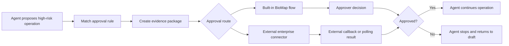

# Approval Center Design

## Goal

Add an enterprise **审批中心** for BioMap Agent. It is the governance and configuration surface for formal Approval Requests generated by Agent Runs, asset operations, experiment operations, and enterprise integrations.

The first implementation remains a frontend Demo. It should make the product model clear enough to support later backend design:

- Which operations require approval.
- Which approval route is used: BioMap built-in approval or an external enterprise approval system.
- Who can approve when BioMap owns the workflow.
- What evidence package is attached to each request.
- How approval events appear in management views, Thread context, Run Inspector, and future Notification Center.

## Product Boundary

Follow [CONTEXT.md](/Users/songxuzhengjun/Documents/BioMapAgent/CONTEXT.md):

- **Approval** is an Agent subsystem for requesting, recording, and displaying human decisions during a Run.
- **Human Confirmation** is a lightweight user checkpoint. It is not the same as formal Approval.
- **Signature Block** is an ELN Document block that may reference an Approval artifact. It is not the Approval workflow itself.
- **Run Inspector** summarizes approvals for one Thread. It is not the system management surface.
- **审批中心** is the system management surface for Approval governance, records, rules, flows, and enterprise integration.

User-facing Chinese should use:

- `审批中心` for the management surface.
- `审批` for formal Approval Request.
- `确认` for Human Confirmation.
- `通知中心` for the future notification module.

Avoid using `签名系统`, `电子签章系统`, `财务审批`, or `工单系统` when referring to this feature.

## Scope

Included in the first design:

- Add `审批中心` entry under the top-right user dropdown.
- Define Approval Center information architecture.
- Define operation rules, approval flows, approver groups, evidence packages, approval records, and audit logs.
- Define black-box external approval integration.
- Define Notification Center context, but not the full Notification Center page.
- Define mock data for approval governance and approval records.
- Define frontend-only Demo behavior for configuration and records.

Not included:

- Real backend workflow engine.
- Real external enterprise approval API.
- Real notification delivery.
- Real permission enforcement beyond demo-level UI state.
- Full BPMN designer.
- Full form designer.
- ELN Signature Block implementation.
- Editing or mutating historical approval decisions.

## Navigation

The Approval Center is not a top-level navigation tab. It sits in the top-right user dropdown.

Dropdown structure:

```text
zhengjun ▼
  通知中心
  审批中心
  管理后台
```

Rules:

- `通知中心` is listed first because approvals are one kind of notification.
- `审批中心` opens the Approval Center management surface.
- The global notification bell remains a notification entry, not an approval-only entry.
- The current Demo may keep `通知中心` disabled or route it to a lightweight coming-soon page, but the menu item should exist as product context.

## Approval Center IA

Approval Center uses a management layout: left menu plus main content. It should feel like an enterprise configuration console, not a chat surface.

Left menu:

```text
审批中心
  总览
  待处理
  我发起的
  审批记录
  操作规则
  审批流程
  审批人组
  企业对接
  审计日志
  模拟测试
```

Default page: `总览`.

### 总览

Purpose: show operational health and governance coverage.

Content:

- Pending approvals count.
- Overdue approvals count.
- Requests started today.
- External sync failures.
- High-risk operations covered by rules.
- Recent approval records.
- Rules needing attention.
- External connector health.

Visual style:

- Dense enterprise dashboard.
- Use compact metric tiles and tables.
- Avoid large marketing cards.
- Do not show a chat composer.

### 待处理

Purpose: current user's actionable approval queue.

Columns:

- 审批标题
- 操作类型
- 项目
- 发起人
- 当前节点
- 截止时间
- 风险等级
- 状态
- 操作

Actions:

- 查看资料包
- 通过
- 驳回
- 要求补充

First Demo behavior:

- Buttons can update local mock state.
- No real backend submission.
- No Toast for every state change unless it clarifies a failure.

### 我发起的

Purpose: requests started by the current user or Agent on the user's behalf.

Columns:

- 审批标题
- 操作类型
- 当前状态
- 当前处理人或外部系统状态
- 发起时间
- 最近更新
- 操作

Actions:

- 查看详情
- 撤回
- 复制资料包

Withdraw behavior:

- Built-in approval: request enters `withdrawn`.
- External approval: BioMap sends a withdraw/cancel notification to the external system. Until callback confirms success, show `撤回中`.

### 审批记录

Purpose: immutable history of approval results.

Columns:

- 审批编号
- 审批标题
- 操作类型
- 项目
- 审批路线
- 结果
- 发起人
- 完成时间
- 审计完整度

Rules:

- Approved/rejected/voided decisions are immutable.
- To change a decision, create a new approval request or void the old one with audit reason.
- Records can be filtered but not edited.

### 操作规则

Purpose: decide which operations require approval and which route they use.

Columns:

- 规则名称
- 适用范围
- 操作类型
- 条件摘要
- 审批路线
- 资料包模板
- 优先级
- 状态
- 版本
- 操作

Rule examples:

| Rule | Scope | Operation | Route |
| --- | --- | --- | --- |
| 实验订单提交审批 | Project | Submit Experiment Order | Built-in flow |
| 公共数据集发布审批 | Organization | Publish AI-Ready Dataset | Built-in flow |
| 公共知识库发布审批 | Organization | Publish KnowledgeBase | Built-in flow |
| CRO 订单企业审批 | Organization | Create external CRO Order | External connector |
| 公共 SOP / 配方修改审批 | Organization | Modify public SOP / Recipe | Built-in flow |
| 关键资产删除审批 | Organization | Delete key assets | Built-in flow |

Rule matching:

- Only enabled rules participate.
- Scope is evaluated from narrow to broad: project rule can override organization default.
- If multiple rules match at the same scope, the highest priority rule wins.
- The first version does not merge multiple approval flows.
- The matching rule version is bound to the Approval Request when the request is created.

### 审批流程

Purpose: configure built-in BioMap approval flows.

A flow is a versioned sequence of stages. Each stage defines approvers and completion policy.

Stage fields:

- 节点名称
- 审批人来源
- 审批模式: `任一通过` / `全部通过`
- 节点顺序: sequential by default
- 超时策略
- 可否要求补充
- 可否转交

Approver sources:

- 固定用户
- 审批人组
- 项目角色
- 组织角色
- 发起人的上级
- 资产 Owner
- Experiment Owner

Timeout policies:

- `仅提醒`: send reminders but keep pending.
- `升级`: notify fallback approver group.
- `过期`: mark request expired and stop Agent continuation.

No auto-approve in the first version.

### 审批人组

Purpose: reusable approver groups.

Examples:

- Antibody Program Leads
- Wet Lab Operations Leads
- Data Governance Reviewers
- Model Governance Reviewers
- External CRO Operations
- Public Asset Steward

Fields:

- Group name.
- Scope.
- Members.
- Owner.
- Used by flows.
- Status.

### 企业对接

Purpose: configure black-box external approval connectors.

External approval is intentionally opaque to BioMap:

- BioMap submits an approval request and evidence package.
- External enterprise system owns its workflow, stages, assignees, and rules.
- BioMap receives callbacks or polls status.
- BioMap records enough audit metadata for traceability.

Connector fields:

- Connector name.
- Provider type: 企业微信 / 飞书 / 钉钉 / HTTP Webhook / Custom.
- Status.
- Target external flow key.
- Submission endpoint.
- Callback endpoint.
- Withdraw endpoint.
- Retry policy.
- Authentication label.
- Last sync status.

Status mapping:

| External Event | BioMap Status |
| --- | --- |
| submitted | pending |
| approved | approved |
| rejected | rejected |
| canceled / withdrawn | withdrawn |
| expired | expired |
| failed / unknown | syncFailed |

Withdraw semantics:

- User clicks withdraw in BioMap.
- BioMap calls external withdraw/cancel API or sends a withdraw notification.
- Approval Request shows `撤回中`.
- If external system confirms, request becomes `withdrawn`.
- If external system rejects or times out, request shows `撤回失败`; main approval status remains pending unless external callback later changes it.

Audit completeness:

- `result-level`: external system only returns final approved/rejected result.
- `node-level`: external system returns external node names and timestamps.
- `complete`: external system returns decision actors, comments, attachments, and timestamps.

BioMap must display audit completeness clearly in records.

### 审计日志

Purpose: immutable event trail.

Events:

- Rule created / updated / disabled.
- Flow created / updated / published.
- Approval request created.
- Approval assigned.
- Approval approved / rejected / expired / withdrawn / voided.
- External submission succeeded / failed.
- External callback received.
- External withdraw requested / succeeded / failed.

Audit log fields:

- Time.
- Actor.
- Event type.
- Target object.
- Before / after summary.
- Source: UI / Agent / API / external callback.

### 模拟测试

Purpose: let admins test how a hypothetical operation would route before enabling rules.

Inputs:

- Operation type.
- Project.
- Asset type.
- Risk level.
- External vendor.
- Amount / budget when relevant.
- Public or project scope.

Output:

- Matched rule.
- Approval route.
- Flow stages or external connector.
- Evidence package template.
- Expected pending approvers.

This is a demo-friendly page and useful for explaining rule matching.

## Operation Types

The first version should support these high-risk operation types:

| Operation Type | Chinese Label | Default Need |
| --- | --- | --- |
| `submitExperimentOrder` | 提交实验订单 | Approval |
| `startLimsRun` | 启动 LIMS 执行 | Approval for regulated projects |
| `publishAiReadyDataset` | 发布 AI-Ready Dataset 到公开范围 | Approval |
| `publishKnowledgeBase` | 发布知识库到公开范围 | Approval |
| `publishOracleOrModel` | 发布 Oracle / Model | Approval |
| `releaseExternalResultPackage` | 发布外部结果包 | Approval |
| `createCroOrder` | 创建外部 CRO 订单 | Approval |
| `modifyPublicRecipeOrSop` | 修改公共配方 / SOP | Approval |
| `deleteKeyAsset` | 删除关键资产 | Approval |

Low-impact checkpoints such as choosing candidate count, confirming objective weights, or selecting report tone should remain Human Confirmation.

## Agent Semantics

When an operation matches an approval rule:

1. Agent pauses at an Approval Gate.
2. Agent prepares an evidence package from the current Run, Project assets, and operation payload.
3. Agent creates an Approval Request using the matched rule version.
4. If route is built-in, BioMap assigns approvers according to the flow version.
5. If route is external, BioMap submits the evidence package to the external connector.
6. Agent waits.
7. If approved, Agent continues the operation.
8. If rejected, Agent stops the operation and returns to draft/revision mode.
9. If expired, Agent keeps the operation stopped.
10. If withdrawn, Agent returns the operation to draft state.

Mermaid overview:



## Evidence Package

Evidence package is versioned and operation-specific. It is the core object that makes approvals useful and auditable.

Shared fields:

- Approval request title.
- Operation type.
- Project.
- Run id.
- Thread id.
- Initiator.
- Risk level.
- Target object id.
- Target object summary.
- Generated by Agent or user.
- Source artifacts.
- Policy version.
- Flow version or external connector version.

Operation-specific templates:

### Experiment Order

- Experiment objective.
- Candidate list.
- Assay panel.
- Sample count.
- Plate map summary.
- CRO or internal execution route.
- Budget / turnaround estimate.
- Safety and QC notes.
- Attached draft order.

### AI-Ready Dataset Publication

- Dataset schema.
- Source files.
- QC summary.
- Missing values / outlier policy.
- Privacy and sharing scope.
- Project lineage.
- Recommended consumers.

### KnowledgeBase Publication

- Knowledge base type: RAG / 知识图谱 / GraphRAG.
- Source files and source tables.
- Entity / relation summary when applicable.
- Build version.
- Data freshness.
- Public scope reason.
- Known limitations.

### Oracle / Model Publication

- Model / Oracle version.
- Training data summary.
- Evaluation summary.
- Intended use.
- Known failure modes.
- Deployment target.
- Rollback plan.

### Public SOP / Recipe Modification

- Current version.
- Proposed version.
- Diff summary.
- Affected experiments.
- Validation status.
- Rollback plan.

## Approval Request Lifecycle

Recommended states:

```ts
type ApprovalStatus =
  | 'draft'
  | 'pending'
  | 'approved'
  | 'rejected'
  | 'expired'
  | 'withdrawRequested'
  | 'withdrawn'
  | 'voided'
  | 'syncFailed'
```

State rules:

- `draft`: evidence package exists, request not submitted.
- `pending`: submitted and waiting for decision.
- `approved`: immutable positive decision.
- `rejected`: immutable negative decision.
- `expired`: timeout policy expired the request.
- `withdrawRequested`: external withdraw has been requested but not confirmed.
- `withdrawn`: request was withdrawn before final decision.
- `voided`: admin invalidated the record with reason.
- `syncFailed`: external submission or callback handling failed.

Decision records are immutable. Corrections require a new request, withdraw, restart, supplement, or void event.

## Notification Center Context

Notification Center is a separate module. It is not implemented in this spec, but approval events must be modeled so the future module can consume them.

Approval notification types:

```ts
type ApprovalNotificationType =
  | 'approval_requested'
  | 'approval_approved'
  | 'approval_rejected'
  | 'approval_expired'
  | 'approval_withdraw_requested'
  | 'approval_withdrawn'
  | 'approval_sync_failed'
```

Notification payload should include:

- Notification id.
- Approval request id.
- Operation type.
- Project.
- Actor.
- Target user or group.
- Created time.
- Read state.
- Deep link target.

Notification Center should eventually show all platform notifications, not only approval notifications.

## Data Model

Suggested frontend mock types:

```ts
type ApprovalRoute = 'builtIn' | 'external'
type ApprovalScope = 'organization' | 'project'

type ApprovalRule = {
  id: string
  name: string
  scope: ApprovalScope
  projectId?: string
  operationType: ApprovalOperationType
  conditionSummary: string
  route: ApprovalRoute
  flowId?: string
  connectorId?: string
  evidenceTemplateId: string
  priority: number
  enabled: boolean
  version: string
  updatedAt: string
}

type ApprovalFlow = {
  id: string
  name: string
  scope: ApprovalScope
  version: string
  status: 'draft' | 'published' | 'disabled'
  stages: ApprovalStage[]
}

type ApprovalStage = {
  id: string
  name: string
  approverSource: 'fixedUsers' | 'approverGroup' | 'projectRole' | 'orgRole' | 'manager' | 'assetOwner' | 'experimentOwner'
  approverLabel: string
  approvalMode: 'any' | 'all'
  timeoutPolicy: 'remindOnly' | 'escalate' | 'expire'
}

type ApprovalConnector = {
  id: string
  name: string
  provider: 'wecom' | 'feishu' | 'dingtalk' | 'webhook' | 'custom'
  externalFlowKey: string
  status: 'healthy' | 'warning' | 'disabled'
  auditCompleteness: 'result-level' | 'node-level' | 'complete'
  lastSyncAt: string
}

type ApprovalRequest = {
  id: string
  title: string
  operationType: ApprovalOperationType
  status: ApprovalStatus
  route: ApprovalRoute
  projectName: string
  initiator: string
  currentAssigneeLabel: string
  ruleVersion: string
  flowVersion?: string
  connectorId?: string
  evidencePackageId: string
  auditCompleteness: 'result-level' | 'node-level' | 'complete'
  createdAt: string
  updatedAt: string
  completedAt?: string
}
```

Keep UI text in mock data where possible. Components should render structured records rather than deriving behavior from display strings.

## Permissions

Demo-level roles:

| Role | Capability |
| --- | --- |
| Ordinary member | View own pending approvals and approvals they initiated |
| Project admin | Manage project-scoped rules and view project approval records |
| Organization admin | Manage org rules, flows, approver groups, connectors, and audit logs |
| Platform admin | Manage default templates and demo system settings |

The first frontend implementation can simulate role-limited views with mock data. It does not need real auth.

## UI Design Principles

- Enterprise management density: compact tables, filters, side panels, and small metric blocks.
- Avoid marketing hero sections.
- Avoid chat bubbles in Approval Center.
- Keep primary actions close to the table or detail context.
- Use status badges sparingly.
- Use high-contrast warning only for pending, overdue, sync failure, and destructive actions.
- Use detail drawers or detail pages for evidence package review.
- External approval rows must visibly show they are controlled by an external system.

## Mock Data

Recommended mock requests:

1. `BM-APR-20260615-001`: EGFR Top 3 wet-lab Experiment Order approval, built-in, approved.
2. `BM-APR-20260615-002`: Publish EGFR GraphRAG KnowledgeBase to public scope, built-in, pending.
3. `BM-APR-20260615-003`: Create external CRO order for SEC-HPLC assay, external, pending.
4. `BM-APR-20260615-004`: Publish xTrimoAbAffinity_DDG project model, built-in, rejected.
5. `BM-APR-20260615-005`: Modify public BLI KD recipe, built-in, expired.
6. `BM-APR-20260615-006`: Delete old candidate dataset, built-in, withdrawRequested.
7. `BM-APR-20260615-007`: External enterprise approval callback failure for CRO result release, external, syncFailed.

Recommended mock flows:

- 实验订单标准审批: Experiment Owner -> Wet Lab Operations Lead.
- 公共资产发布审批: Asset Owner -> Data Governance Reviewers.
- 模型发布审批: Model Owner -> Model Governance Reviewers.
- 关键资产删除审批: Project Admin -> Organization Admin.

Recommended mock connectors:

- 企业微信审批集成: healthy, node-level audit.
- 飞书审批集成: warning, result-level audit.
- Custom HTTP Approval: disabled, complete audit when enabled.

## Acceptance Criteria

Product behavior:

- User dropdown includes `通知中心`, `审批中心`, and `管理后台`.
- Opening `审批中心` lands on `总览`.
- Approval Center left menu contains all planned sections.
- `操作规则` page shows operation rules with route, priority, status, and version.
- `审批流程` page shows built-in flows and stage details.
- `企业对接` page clearly represents external approval as black-box integration.
- `审批记录` page shows immutable records and audit completeness.
- `模拟测试` can show a matched rule and route from mock inputs.

Terminology:

- UI distinguishes `审批` from `确认`.
- UI does not call Approval an ELN Signature Block.
- Notification Center is referenced as future cross-module notification surface.

External approval:

- External flow stages are not modeled as internal BioMap approval stages.
- Withdraw displays `撤回中` before external confirmation.
- Sync failure is visible and auditable.

Demo constraints:

- No real API calls.
- No backend persistence.
- No true enterprise auth.
- No full Notification Center implementation.

## Spec Self-Review

- No unresolved gaps remain.
- Scope is constrained to a single Approval Center design and its required context.
- External enterprise approval is explicitly black-box.
- Notification Center is included as context only.
- Approval, Human Confirmation, Run Inspector, and ELN Signature Block boundaries are explicit.
- The first implementation can be built as a frontend-only Demo with mock data.
